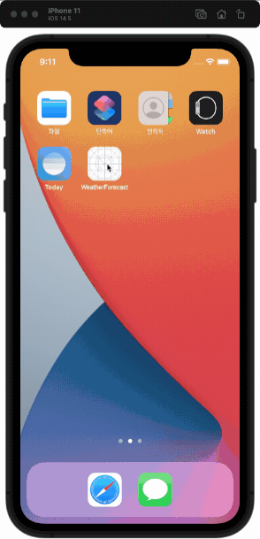

# 날씨 정보 앱

| 📺 데모 | 💡 개요 |
| ------- | ------- |
|  | 🚀 현재 위치의 날씨와 3시간 단위의 5일 예보   🧑🏻‍💻 개인 프로젝트   🗓 진행 기간   &nbsp;&nbsp;&nbsp;&nbsp; 캠프 기간: 2021.01.18 ~ 24 (1주)   &nbsp;&nbsp;&nbsp;&nbsp; 캠프 수료 후: 2021.09 ~ 리팩토링 진행   ⚙️ 기능   &nbsp;&nbsp;&nbsp;&nbsp; `현재 위치의 날씨 정보 표시`   &nbsp;&nbsp;&nbsp;&nbsp; `당겨서 새로고침`   &nbsp;&nbsp;&nbsp;&nbsp; `다크모드 지원`    📝 학습 키워드   &nbsp;&nbsp;&nbsp;&nbsp; `CoreLocation`, `URLSession`, `RefreshControl` |

   

## 목차

1. 프로젝트
    - [기능](#기능)
    - [그라운드 룰](#그라운드-룰)
    - [GitHub 프로젝트 관리기능 사용해보기](#GitHub-프로젝트-관리기능-사용해보기)
2. [다크 모드 지원](#다크-모드-지원)
3. [위치 서비스 접근 권한 허용하지 않은 경우 예외 처리](#위치-서비스-접근-권한-허용하지-않은-경우-예외-처리)

### 정리 예정

- [API Response 데이터 모델 리팩토링](#API-Response-데이터-모델-리팩토링)
- [API 데이터 요청](#API-데이터-요청)
- [트러블 슈팅](#트러블-슈팅)
- [오토 레이아웃](#오토-레이아웃)
- 정리 목록
    - MVC 패턴 준수
    - 끌어서 새로고침시 새로고침 애니메이션 종료하는 시점
    - API 리퀘스트 객체의 재사용성
    - 다이나믹 폰트
    - 앱 실행시 데이터 받기 전까지 테이블 뷰 비어보임
        - 이전의 마지막 데이터 보이는 방법?
        - 로딩 애니메이션 보이는 방법?

   

## 기능

| 현재 위치의 날씨 정보 | 당겨서 새로고침 | 다크모드 지원 |
| :-: | :-: | :-: |
|  |  |  |

[👆목차로 가기](#목차)
   

## 그라운드 룰

혼자 진행하는 프로젝트지만 그라운드 룰을 지키려고 노력했다.

- 저녁 9시에는 하던 작업 마무리하고 10시까지 TIL 정리하고 끝내기
- 휴일(수,토,일) 에는 쉬거나 이전 작업내용을 다시 돌아보기
    - 새로운 작업은 하지말고 리패토링 위주로
- 프로젝트 기능요구서에 충실하기
    - 기능요구서 내용을 충실하게 먼저 완료하기
    - 이후 시간이 남으면 추가 구현

### 프로젝트 규칙

- 코딩 컨벤션
    - Swift API 디자인 가이드라인을 따르려고 노력하기
    - 클래스, 함수, 변수 명을 명확하고 객관적인 이름으로 하기
    - 가능한 주석 없이 이해가능한 코드 추구하기
- 브랜치 단위
    - 스텝별로 브랜치 만들어서 작업하기 (ex: "step-1", "step-2")
    - 각 스텝의 기능단위로 하위 브랜치 만들고 완료되면 스텝 브랜치로 머지
    - 스텝완료되면 브랜치를 원본 저장소로 PR 보내고 코드 리뷰 받기

### 커밋 메시지 규칙

- 한글로 작성하기 (단, 제목의 Type은 영문으로 작성)
- Title
    - Type과 이슈번호 붙이기
    - 양식: Type #이슈번호 - 내용  
    - 예시: Feat #1 - 버튼 기능 추가  
- Type 리스트
    - Feat: 코드, 새로운 기능 추가
    - Fix: 버그 수정
    - Docs: 문서 수정
    - Style: 코드 스타일 변경 (기능, 로직 변경 x)
    - Test: 테스트 관련
    - Refactor: 코드 리팩토링
    - Chore: 이외 기타 작업
- Description
    - Title은 간단하게 Description은 상세하게
    - Title만으로 설명이 충분하면 Description은 없어도 됨
    - Title에서 한칸 빈칸을 띄우고 작성

### GitHub 프로젝트 관리기능 사용해보기

- 이슈와 프로젝트 기능 활용
    - 작업 시작전에 이슈 꼭 등록하고 커밋메세지에 이슈번호 포함!
- [github 하나로 1인 개발 워크플로우 완성하기: 이론편](https://www.huskyhoochu.com/issue-based-version-control-101)
- [github 하나로 1인 개발 워크플로우 완성하기: 실전 편](https://www.huskyhoochu.com/issue-based-version-control-201/#open-issue)
- [좋은 git 커밋 메시지를 작성하기 위한 8가지 약속](https://djkeh.github.io/articles/How-to-write-a-git-commit-message-kor/)

[👆목차로 가기](#목차)
   

## 다크 모드 지원

다크 모드는 눈 피로도 감소, 사용 전력 감소 등의 장점이 있고 사용자가 원하는 기능이라 생각하여 지원했다.
  
| 모드 설정 변경 | 라이트 모드 | 다크 모드 |
| :-: | :-: | :-: |
|  |  |  |

### 공식 문서 참고

실무에서는 디자이너나 기획자가 구체적인 가이드를 주겠지만, 여의치 않은 경우 구체적인 가이드 없이 개발자가 작업할 수도 있을 것이다.  
다행히 애플은 손쉽게 다크 모드를 지원할 수 있는 방법들을 마련해 두었다.  
  
애플 공식 문서를 참고하여 다크 모드 관련 내용을 정리했다.

- [H.I.G - Dark Mode](https://developer.apple.com/design/human-interface-guidelines/ios/visual-design/dark-mode/)
    - 다크 모드는 iOS 13부터 지원
    - 설정에서 다크 모드를 선택하는 방법을 준수하기 (앱 자체 설정을 만들지 말고 설정 앱의 설정을 따르라는 것)
    - 앱 자체의 설정 옵션으로 만든다면 더 힘들 것이고, 최악의 경우 앱이 깨질 수 있음.
    - 라이트 모드, 다크 모드 둘 다 테스트 해봐야 한다.
- [H.I.G - Color](https://developer.apple.com/design/human-interface-guidelines/ios/visual-design/color/)
    - 시스템 컬러를 사용하면 라이트/다크 모드를 자동으로 지원할 수 있음 (같은 색이라도 모드별로 색상 값이 살짝 다르다)
    - semantic color로 Label, Placeholder text, link 등의 색상이 정의되어 자동으로 다크 모드를 지원한다.
- [Providing Images for Different Appearances](https://developer.apple.com/documentation/uikit/uiimage/providing_images_for_different_appearances) (이미지에 다크 모드 지원하기)
    - different appearances를 관리하는 좋은 방법은 에셋 카탈로그를 사용하는 것
    - 시스템이 자동으로 현재 설정에 맞는 적절한 이미지를 그린다. 설정을 변경하면 새로운 설정으로 다시 그린다

### 구현 방법

화면에 배경 이미지와 텍스트만 있으므로 이 두가지만 다크 모드를 지원하면 되겠다.

#### 1. 배경 이미지 다크 모드 지원

배경 이미지를 라이트/다크 모드로 나누어 에셋 카탈로그에 Imges Set으로 등록한다.

이제 배경 이미지 에셋의 이름 `Desert_Tree`를 사용하면 시스템이 자동으로 라이트/다크 모드에 맞는 이미지를 그린다.

~~~swift
private let backgroundImageView: UIImageView = {
    let imageView = UIImageView()
    imageView.image = UIImage(named: "Desert_Tree")
    imageView.contentMode = .scaleAspectFill
    return imageView
}()
~~~

#### 2. 텍스트에 다크 모드 지원

이 앱에 사용된 텍스트는 모두 Label로 구현했다.  
Label은 `semantic color - Label`를 사용하면 자동으로 다크 모드를 지원하므로 이 것을 사용하며, Label 텔스트의 기본값이므로 추가 작업 없이 그대로 사용하면 된다.

### 트러블 슈팅

#### 1. 배경 이미지를 넣기 위해 ViewController의 view에 `이미지 뷰`로 추가하니 테이블 뷰 위에 그려져서 가려지는 문제

- 이미지 뷰와 테이블 뷰가 그려지는 순서 때문이라 생각하고 `bringSubviewToFront()`, `sendSubviewToBack()` 메서드를 사용해 봤지만 변함없었다.
- 해결 방법: backgroundImageView를 tableView.backgroundView로 set 해서 해결 (문서를 보면 이 프로퍼티에 뷰를 할당하면 테이블 뷰가 자동으로 리사이즈 해주므로 오토 레이아웃을 따로 추가할 필요가 없다), 이때 테이블 뷰 셀의 backgroundColor을 clear로 해주어야 테이블 뷰의 배경 이미지가 보인다.

[👆목차로 가기](#목차)
   

## 위치 서비스 접근 권한 허용하지 않은 경우 예외 처리

앱을 처음 실행하면 사용자에게 위치 서비스 접근 권한을 요청하며, 허용하면 현재 위치를 기반으로 날씨 정보를 출력하고, 거절하면 위치 정보를 얻을 수 없으므로 앱은 아무런 동작을 하지 않는다.  
  
이때 사용자는 입장에서는 아무런 동작이 없으니 문제 있는 앱이라고 생각할 수 있고, 위치 서비스 접근 권한이 꼭 필요한지 모르는 상태일 것이다.  
  
이것을 개선하기 위해 위치 권한 설정을 강하게 요청하는 방법으로 예외 처리를 추가했다.

- Alert을 통해 앱 사용을 위해서는 위치 권한 허용이 필수라는 내용을  고지하고, 설정으로 이동하는 버튼을 제공한다. 
- 위치 권한을 거절하면 날씨 정보를 보여주지 않고, 앱을 재시작하거나 날씨 정보를 요청할 때마다 Alert을 표시한다.

| 예외 처리 전 | Alert, 설정으로 이동 | 계속 거절하는 경우 |
| :-: | :-: | :-: |
|  |  | |

### 다른 앱의 처리 방법

처리 방법을 생각하기에 앞서서 다른 앱은 어떻게 처리하는지 살펴봤다.

- 애플 지도 앱
    - 위치 권한 거절 후 현재 위치 버튼을 누르면 Alert이 표시되며 앱의 기능을 제대로 사용하기 위해서는 위치 권한이 필요하다는 내용과 `설정에서 켜기` 버튼이 주어진다
    - `설정에서 켜기` 버튼을 누르면 설정 앱 내부의 지도 앱 설정으로 이동한다.
- 애플 날씨 앱
    - 위치 권한 거절하면 현재 위치의 날씨를 표시하는 화면이 사라지고, 주소 검색으로 특정 지역의 날씨를 볼 수 있는 화면만 남아있다.
    - 지도 앱과 다르게 Alert으로 표시하지 않는 데, 내 생각으로는 위치를 직접 검색하는 방법이 있으므로 위치 권한을 강제하지 않는 것 같다
- 날씨날씨 앱
    - 기본적으로 날씨 앱과 유사
    - 주소 검색 화면에서 `GPS 현재 위치` 설정을 누르면 설정 앱 내부의 날씨날시 앱 설정으로 이동한다.

위치 정보를 사용하는 기능이 앱의 주요 기능 이라면 Alert을 통해 사용자에게 위치 권한의 필요성을 알리고, 설정 앱으로 이동하는 버튼을 제공한다.  

### 공식 문서 참고

- [H.I.G - Settings](https://developer.apple.com/design/human-interface-guidelines/ios/app-architecture/settings/) 
    - 위치 서비스 권한 설정으로 가는 방법을 사용자에게 텍스트로 알려주기보다는 바로 이동시키는 버튼을 제공하라.

### 예외 처리 방법 고민

더 나은 UX를 위한 여러 방법이 생각났지만 시간이 부족하므로 기능 추가는 최소로 하지만 적절한 처리가 이루어지는 방향으로 고민했다.

- 현재 위치의 날씨를 보여주는 앱 컨셉을 유지하는 처리방법 생각해보기.
- 주소를 직접 검색하는 기능을 지금 추가하기엔 큰 작업이며 현재 위치의 날씨 정보를 보여주는 앱의 컨셉 범위를 벗어나는 기능이다.
- 위치 서비스 접근은 사용자의 허가가 꼭 필요하다. 앱이 강제로 켜는 방법은 없으므로, 사용자에게 강하게 요청하는 방법을 찾아야 한다.

### 위치 권한 설정을 강하게 요청하기

- 앱 사용을 위해서는 위치 권한 허용이 필수라는 내용을 Alert을 통해 고지하고, 설정으로 이동하는 버튼을 제공한다. 
- 위치 권한을 거절하면 날씨 정보를 보여주지 않고, 앱을 재시작하거나 날씨 정보를 요청할 때마다 Alert을 표시한다.

위치 접근 허용을 거절한 경우의 흐름은 아래와 같다.

1. 앱 실행 시 Alert을 통해 위치 권한을 요청하고, 설정으로 이동하는 버튼을 제공
2. "설정으로 이동" 버튼 선택한 경우
    - 설정 앱 내부의 앱 설정으로 이동
    - 위치 권한 허용하고 다시 앱으로 돌아오면 정상적으로 동작
3. "위치 사용 안 함" 버튼 선택한 경우
    - 앱 기능이 동작하지 않으므로 빈 화면만 표시
    - 아래로 당기면(리프레시 하면) `1`의 Alert 표시 반복

[👆목차로 가기](#목차)
   

## API Response 데이터 모델 리팩토링

### 1. 하위 모델 통합

모델마다 구조체로 분리했더니 날씨 데이터 모델 파일만 7개다.

~~~
// 리팩토링 전 모델

Model
- CurrentWeather.swift
- WeatherForecast.swift

SubModel
- Coordinate.swift
- Weather.swift
- temperature.swift
- WeatherForecastItem.swift
- City.swift
~~~

이러다 보니 모델의 프로퍼티에 사용된 서브모델의 내용을 보려면 해당 파일을 열고 확인해야 해서 내용을 파악하기가 불편하다는 생각이 들었다.  
  
API Reponse 명세서를 다시 확인하여 `CurrentWeather`와 `WeatherForecast` 두 모델에서 공통적으로 사용되는 서브모델인 `Coordinate`, `Weather`, `temperature`는 남기고, 각 모델에서만 사용하는 서브모델은 해당 모델에서 정의하는 것으로 변경해서 모델의 구성을 좀 더 알아보기 쉽게 리팩토링했다.  
  
또, API Response로 전달받는 `데이터`라는 의미를 명확하게 해주기 위해 각 API 모델의 뒤에 `Data`를 붙여주었다.

~~~
// 리팩토링 후 모델

Model
- CurrentWeatherData.swift
- WeatherForecastData.swift
    - Item
    - City

SubModel
- Coordinate.swift
- Weather.swift
- temperature.swift
~~~

### 2. JSON 데이터의 `Weather` 항목

이유는 모르지만 API Response JSON 데이터의 `Weather` 항목이 원소가 1개만 있는 배열로 구성된다.

~~~json
{
  "weather": [
    {
      "id": 800,
      "main": "Clear",
      "description": "clear sky",
      "icon": "01d"
    }
  ],
}
~~~

그러므로 `Weather` 배열은 첫 번째 원소에만 접근해야 한다는 것을 모델 코드만 보고도 유추가 가능하고, 안전하게 사용할 수 있도록 배열에는 `private` 접근 제한을 하고 첫 원소만 반환하는 프로퍼티를 추가했다.

~~~swift
struct CurrentWeatherData: Decodable {
    private let weathers: [Weather]
    var weather: Weather? {
        return weathers.first
    }
}
~~~

[👆목차로 가기](#목차)
   

## API 데이터 요청

- API 에러 타입을 따로 분리하여 두 API에서 동일하게 사용
- get 메서드 내부의 기능을 별도 함수로 분리, 제네리사용

### 리팩토링 전

~~~swift
func getData(coordinate: CLLocationCoordinate2D, completionHandler: @escaping (Result<CurrentWeatherData, APIError>) -> Void) {
    guard let url = URL(string: "\(baseURL)lat=\(coordinate.latitude)&lon=\(coordinate.longitude)&units=metric&appid=\(apiKey)") else {
        completionHandler(.failure(.invalidURL))
        return
    }
    
    let dataTask = urlSession.dataTask(with: url) { data, _, error in
        if let error = error {
            print(error.localizedDescription)
            completionHandler(.failure(.requestFailed))
            return
        }
        guard let data = data else {
            completionHandler(.failure(.noData))
            return
        }
        
        if let decodedData: CurrentWeatherData = try? JSONDecoder().decode(CurrentWeatherData.self, from: data) {
            completionHandler(.success(decodedData))
        } else {
            completionHandler(.failure(.invalidData))
        }
    }
    dataTask.resume()
}
~~~

#### API Request 객체

APIClient
- 직접 request하는 객체
- 다른 API에서도 두루 쓸수 있도록 고민
- 에러 처리

OpenWeatherAPI
- OpenWeatehrAPI 전용으로 고민

OpenWeatehrAPIList
- API 종류에 따라 요청 파라미터를 상수화해서 사용하기 쉽게 고민

### View 디버깅시 뷰 객체 찾기

http://minsone.github.io/mac/ios/quickly-searching-view-when-debug-view-hierachy

[👆목차로 가기](#목차)
   

## 트러블 슈팅

- 현재위치 받는 속도가 느림 5~10초
    - LocatonManager의 desiredAccuracy 설정을 따로 안해서 기본값인 best로 설정되서 느린걸로 판단
    - desiredAccuracy설정을 kCLLocationAccuracyThreeKilometer로 변경했더니 빨라집! (1~2초)
- 다른 기기 시뮬레이터 실행했더니 새로고침해도 계속 빈화면만 나옴
    - 그리고는 원래 되던 기기에서도 같은 증상
    - 위치 정보 에러핸들링을 아직 하지않은 상태여서 파악 되지 않았음 (배운점: 에러처리 당장 못할때는 print로 로그라도 남기자)
    - 시뮬레이터에서 위치 설정을 none으로 꺼둔상태여서 위치정보를 받아오지못해 API에 요청도 되지않아서 발생
    - 되다가 안된이유는 시뮬레이터에서도 위치 정보를 캐시해둬서 캐시된 마지막 위치정보를 받아오는 거였음 (최신 데이터인지 확인해야할 필요 있음- 공식문서에 나옴)

[👆목차로 가기](#목차)
   

## 오토 레이아웃

### equalToSystemSpacingBelow는 무엇을 기준으로 값 변경을 주는가?

- iPhone 11 / Font Size 4
    - dateLabel.firstBaseline = Layout Margin.top + 28
    - Layout Margins.bottom = label.lastBaseline + 14
- iPhone 11 / Font Size 10
    - dateLabel.firstBaseline = Layout Margin.top + 59.5
    - Layout Margins.bottom = label.lastBaseline + 29.5
- 결론: 폰트 사이즈에 따라 결정됨
    - constraint(equalToSystemSpacingBelow:multiplier:) 문서를 보면 system spacing 값은 앵커에서 사용 가능한 정보에 따라 결정되는데, 그 예로 앵커가 text baseline이라면 spacing은 해당 baseline에서 사용된 글꼴에 따라 결정된다고 써있다.

### Readable Content Guides로 아이패드까지 지원해 보기

> [Auto Layout Guide - Working with Constraints in Interface Builder - Readable Content Guides](https://developer.apple.com/library/archive/documentation/UserExperience/Conceptual/AutolayoutPG/WorkingwithConstraintsinInterfaceBuidler.html)
>
> For most devices there is little or no difference between the readable content guides and the layout margins. The difference becomes obvious only when working on an iPad in landscape orientation.

- 사용자가 텍스트를 읽을 때 머리를 움직일 필요없도록 충분히 좁게하기 위함
- most devicews 표현이 애매해서 테스트 해본 결과, 아이폰에서는 layoutMarginGuide와 같고, 아이패드에선 다름
- 시스템의 다이나믹 타입에따라 크기가 달라짐. 사용자가 더 큰 폰트를 선택하면 시스템은 더 넓은 가이드를 생성한다. 폰트 크기가 커지면 사용자는 기기를 더 멀리서 볼테니 이 가이드도 커진다고 되어있음

> [H.I.G - Adaptivity and Layout](https://developer.apple.com/design/human-interface-guidelines/ios/visual-design/adaptivity-and-layout/)
>
> Apply readability margins when displaying text on larger devices. These margins keep text lines short enough to ensure a comfortable reading experience.

[👆목차로 가기](#목차)
   