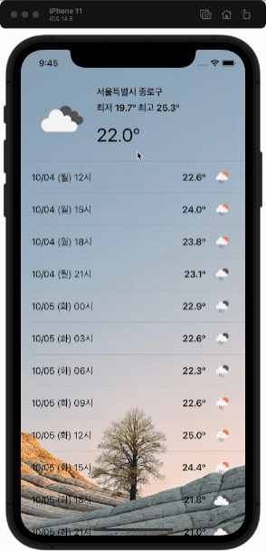
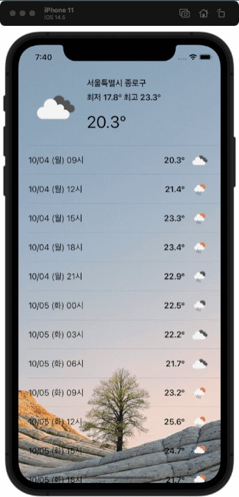
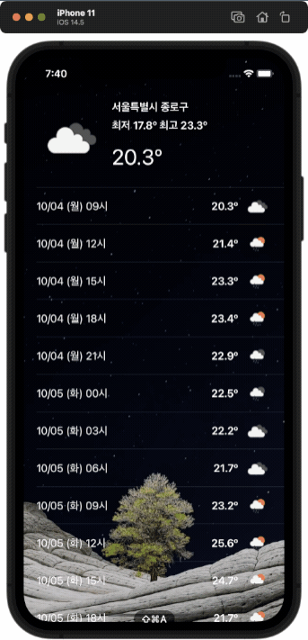
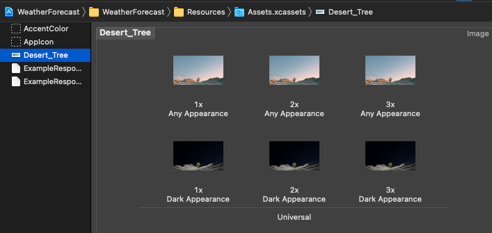
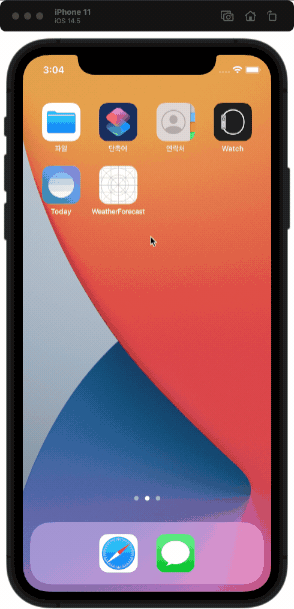
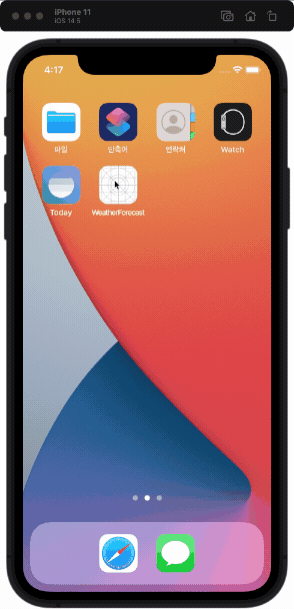
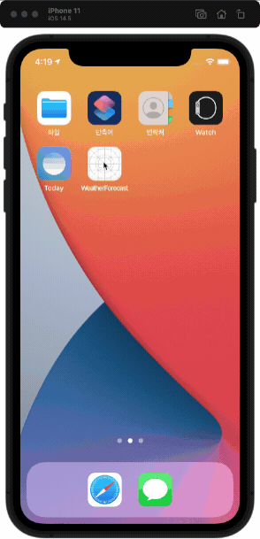

# 날씨 정보 앱

<!--  -->

| 📺 데모 | 💡 개요 |
| ------- | ------- |
|  | 🚀 현재 위치의 날씨와 3시간 단위의 5일 예보   🧑🏻‍💻 개인 프로젝트   🗓 진행 기간   &nbsp;&nbsp;&nbsp;&nbsp; 캠프 기간: 2021.01.18 ~ 24 (1주)   &nbsp;&nbsp;&nbsp;&nbsp; 캠프 수료 후: 2021.09 ~ 리팩토링 진행   ⚙️ 기능   &nbsp;&nbsp;&nbsp;&nbsp; `현재 위치의 날씨 정보 표시`   &nbsp;&nbsp;&nbsp;&nbsp; `당겨서 새로고침`   &nbsp;&nbsp;&nbsp;&nbsp; `다크모드 지원`    📝 학습 키워드   &nbsp;&nbsp;&nbsp;&nbsp; `CoreLocation`, `URLSession`, `RefreshControl` |

   

## 목차

1. 프로젝트
    - [기능](#기능)
    - [그라운드 룰](#그라운드-룰)
    - [GitHub 프로젝트 관리기능 사용해보기](#GitHub-프로젝트-관리기능-사용해보기)
2. Human Interface Guidelines 준수
    - [다크 모드 지원](#다크-모드-지원)
    - [위치 접근 허용하지 않은 경우 예외 처리](#위치-접근-허용하지-않은-경우-예외-처리)
    - [Activity Indicator로 로딩 표시](#Activity-Indicator로-로딩-표시)
    - [Refresh Control로 당겨서 새로 고침](#Refresh-Control로-당겨서-새로-고침)
    - 런치스크린
    - Readable Content Guides
    - 새로고침 요청
    - 로딩 인지시키기
    - 데이터 로드 실패시 처리
    

### 정리 예정

- [API Response 데이터 모델 리팩토링](#API-Response-데이터-모델-리팩토링)
- [API 데이터 요청](#API-데이터-요청)
- [트러블 슈팅](#트러블-슈팅)
    - 배경 이미지를 넣기 위해 ViewController의 view에 `이미지 뷰`로 추가하니 테이블 뷰 위에 그려져서 가려지는 문제
- 고민
    - Refresh Control 애니메이션 종료 시점
- [오토 레이아웃](#오토-레이아웃)
- 정리 목록
    - MVC 패턴 준수
    - 끌어서 새로고침시 새로고침 애니메이션 종료하는 시점
    - API 리퀘스트 객체의 재사용성
    - 다이나믹 폰트

   

## 기능

| 현재 위치의 날씨 정보 | 당겨서 새로고침 | 다크모드 지원 |
| - | - | - |
|  |  |  |

[👆목차로 가기](#목차)
   

## 그라운드 룰

혼자 진행하는 프로젝트지만 그라운드 룰을 지키려고 노력했다.

- 저녁 9시에는 하던 작업 마무리하고 10시까지 TIL 정리하고 끝내기
- 휴일(수,토,일) 에는 쉬거나 이전 작업내용을 다시 돌아보기
    - 새로운 작업은 하지말고 리패토링 위주로
- 프로젝트 기능요구서에 충실하기
    - 기능요구서 내용을 충실하게 먼저 완료하기
    - 이후 시간이 남으면 추가 구현

### 프로젝트 규칙

- 코딩 컨벤션
    - Swift API 디자인 가이드라인을 따르려고 노력하기
    - 클래스, 함수, 변수 명을 명확하고 객관적인 이름으로 하기
    - 가능한 주석 없이 이해가능한 코드 추구하기
- 브랜치 단위
    - 스텝별로 브랜치 만들어서 작업하기 (ex: "step-1", "step-2")
    - 각 스텝의 기능단위로 하위 브랜치 만들고 완료되면 스텝 브랜치로 머지
    - 스텝완료되면 브랜치를 원본 저장소로 PR 보내고 코드 리뷰 받기

### 커밋 메시지 규칙

- 한글로 작성하기 (단, 제목의 Type은 영문으로 작성)
- Title
    - Type과 이슈번호 붙이기
    - 양식: Type #이슈번호 - 내용  
    - 예시: Feat #1 - 버튼 기능 추가  
- Type 리스트
    - Feat: 코드, 새로운 기능 추가
    - Fix: 버그 수정
    - Docs: 문서 수정
    - Style: 코드 스타일 변경 (기능, 로직 변경 x)
    - Test: 테스트 관련
    - Refactor: 코드 리팩토링
    - Chore: 이외 기타 작업
- Description
    - Title은 간단하게 Description은 상세하게
    - Title만으로 설명이 충분하면 Description은 없어도 됨
    - Title에서 한칸 빈칸을 띄우고 작성

### GitHub 프로젝트 관리기능 사용해보기

- 이슈와 프로젝트 기능 활용
    - 작업 시작전에 이슈 꼭 등록하고 커밋메세지에 이슈번호 포함!
- [github 하나로 1인 개발 워크플로우 완성하기: 이론편](https://www.huskyhoochu.com/issue-based-version-control-101)
- [github 하나로 1인 개발 워크플로우 완성하기: 실전 편](https://www.huskyhoochu.com/issue-based-version-control-201/#open-issue)
- [좋은 git 커밋 메시지를 작성하기 위한 8가지 약속](https://djkeh.github.io/articles/How-to-write-a-git-commit-message-kor/)

[👆목차로 가기](#목차)
   

## Human Interface Guidelines 준수하기

Human Interface Guidelines을 준수.

[👆목차로 가기](#목차)
   

## 다크 모드 지원

| 라이트 모드 | 다크 모드 | 라이트/다크 변경 |
| - | - | - |
|  |  |  |
| iOS 12 이하에서 기본 화면   iOS 13 이상에서 라이트 모드 | iOS 13 이상에서 다크 모드 | 라이트/다크 모드 변경 즉시 적용 |

### HIG와 공식문서 참고

다크 모드를 어떻게 지원해야 하는지 HIG와 공식 문서를 살펴봤다.

- [HIG - Dark Mode](https://developer.apple.com/design/human-interface-guidelines/ios/visual-design/dark-mode/)
    - iOS 13 `설정`에서 다크 모드를 선택할 수 있다. 사용자는 모든 앱이 자신의 설정을 따르길 기대할 것 이다. (라이트/다크 모드를 선택할 수 있으니 사용자는 앱이 당연히 지원할 것이라 생각할 것)
    - 설정에서 선택한 모드를 준수하라. (앱안의 설정을 만들지 말고 시스템 설정을 따르는게 작업도 줄어들고 사용자 입장에서도 자연스러움)
    - 라이트/다크 모드에서 디자인을 테스트하라. (라이트 모드에서 좋은 디자인이라도 다크 모드에서는 이상할 수 있음)
    - 현재 모드에 적응하는 다이나믹 컬러를 사용하라. 하드 코딩된 컬러 값이나 적응하지 않는 컬러는 피하라. (Semantic color를 사용하면 현재 모드에 자동으로 적응할 수 있다.)
    - Label에는 시스템 제공하는 label color를 사용하라. (현재 모드에 자동으로 적응)
- [HIG - Color](https://developer.apple.com/design/human-interface-guidelines/ios/visual-design/color/)
    - 시스템 컬러를 사용하면 라이트/다크 모드를 자동으로 지원할 수 있음 (같은 색이라도 모드별로 색상 값이 살짝 다르다)
    - semantic color로 Label, Placeholder text, link 등의 색상이 정의되어 자동으로 다크 모드를 지원한다.
- [Providing Images for Different Appearances](https://developer.apple.com/documentation/uikit/uiimage/providing_images_for_different_appearances) (이미지에 다크 모드 지원하기)
    - different appearances를 관리하는 좋은 방법은 에셋 카탈로그를 사용하는 것
    - 시스템이 자동으로 현재 설정에 맞는 적절한 이미지를 그린다. 설정을 변경하면 새로운 설정으로 다시 그린다

### 다크 모드 지원이 필요한 요소

이제 앱의 화면을 구성하는 아래 요소들에 다크 모드를 지원한다.
1. 배경 이미지
2. Table View
3. Label

#### 1. 배경 이미지 - 에셋 카탈로그 사용

배경 이미지를 라이트/다크 모드로 나누어 에셋 카탈로그에 Imges Set으로 등록한다.

이제 배경 이미지 에셋의 이름 `Desert_Tree`를 사용하면 시스템이 자동으로 라이트/다크 모드에 맞는 이미지를 그린다.

~~~swift
private let backgroundImageView: UIImageView = {
    let imageView = UIImageView()
    imageView.image = UIImage(named: "Desert_Tree")
    imageView.contentMode = .scaleAspectFill
    return imageView
}()
~~~

#### 2. Table View - 백그라운드 뷰 설정

테이블 뷰의 백그라운드 뷰로 `1`의 이미지 뷰를 설정해주면 간단하다.

~~~swift
tableView.backgroundView = backgroundImageView
~~~

테이블 뷰의 구분선인 `separator`는 `semantic color`가 기본값이므로 추가 작업이 필요 없다.

#### 3. Label - 추가 작업 불필요

이 앱의 텍스트는 모두 Label로 구현했다.  
Label은 텍스트 컬러의 기본값은 자동으로 다크 모드를 지원하는 `semantic color`인 `Label`이므로 추가 작업이 필요 없다.

[👆목차로 가기](#목차)
   

## 위치 접근 허용하지 않은 경우 예외 처리

| 예외 처리 전 | Alert으로 `설정으로 이동` 버튼 제공 |
| - | - |
|  |  |

- 예외 처리 전에는 위치 접근을 허용하지 않으면 날씨 정보를 볼수 없지만, 아무런 피드백이 없어서 앱이 멈춘 것 처럼 보인다.
- 위치 정보가 앱 사용에 꼭 필요하므로 위치 접근을 허용하지 않은 경우 Alert으로 `설정으로 이동` 버튼을 제공하여 사용자에게 인지 시킨다.

### HIG 참고

- [H.I.G - Settings](https://developer.apple.com/design/human-interface-guidelines/ios/app-architecture/settings/) 
    - 위치 서비스 권한 설정으로 가는 방법을 사용자에게 텍스트로 알려주기보다는 설정 화면으로 이동시키는 버튼을 제공하라.

### 다른 앱의 처리 방법 참고

- 애플 지도 앱
    - 위치 권한 거절 후 현재 위치 버튼을 누르면 Alert이 표시되며 앱의 기능을 제대로 사용하기 위해서는 위치 권한이 필요하다는 내용과 `설정에서 켜기` 버튼이 주어진다.
    - `설정에서 켜기` 버튼을 누르면 설정 앱 내부의 지도 앱 설정으로 이동한다.
- 애플 날씨 앱
    - 위치 권한 거절하면 현재 위치의 날씨를 표시하는 화면이 사라지고, 주소 검색으로 특정 지역의 날씨를 볼 수 있는 화면만 남아있다.
    - 지도 앱과 다르게 Alert으로 표시하지 않는 데, 내 생각으로는 위치를 직접 검색하는 방법이 있으므로 위치 권한을 강제하지 않는 것 같다
- 날씨날씨 앱
    - 기본적으로 날씨 앱과 유사
    - 주소 검색 화면에서 `GPS 현재 위치` 설정을 누르면 설정 앱 내부의 날씨날시 앱 설정으로 이동한다.
- 정리 
    - 위치 정보를 사용하는 기능이 앱의 주요 기능 이라면 Alert을 통해 사용자에게 위치 권한의 필요성을 알리고, 설정 앱으로 이동하는 버튼을 제공한다.  

### 예외 처리 방법 고민과 결정

- 고민
    - 이 앱은 현재 위치의 날씨를 보여주는 것이 주요 기능이므로 위치정보가 꼭 필요하다.
    - 위치 접근은 사용자의 허가가 꼭 필요하다. 앱이 강제로 켜는 방법은 없으므로, 사용자에게 강하게 요청하자.
- 사용자에게 위치 권한을 강하게 요청하는 방법
    - 앱 사용을 위해서는 위치 권한 허용이 필수라는 내용을 Alert을 통해 고지하고, 설정으로 이동하는 버튼을 제공한다. 
    - 위치 권한을 거절하면 앱을 재시작하거나 날씨 정보를 요청할 때마다 Alert을 표시한다.
- 위치 접근 허용을 거절한 경우의 흐름
    1. Alert을 통해 위치 권한을 요청하고, 설정으로 이동하는 버튼을 제공
    2. "설정으로 이동" 버튼 선택한 경우
        - 설정 앱 내부의 앱 설정으로 이동
        - 위치 권한 허용하고 다시 앱으로 돌아오면 정상적으로 동작
    3. "위치 사용 안 함" 버튼 선택한 경우
        - "현재 위치를 찾을 수 없습니다" 문구와 재시도 버튼 표시
        - 재시도 버튼 누르면 `1`의 Alert 표시 반복

[👆목차로 가기](#목차)
   

## Activity Indicator로 로딩 표시

### 📺 데모

1. 앱을 실행하면 현재 위치를 찾고, 현재 위치의 날씨 데이터를 로드한다.
2. Activity Indicator 애니메이션과 함께 무엇을 로드하는 중인지 표시한다.
    - 위치 로딩 표시: "현재 위치 찾는 중..."
    - 날시 데이터 로딩 표시: "날씨 데이터 로드 중..."
3. 로딩이 완료되면 Activity Indicator는 사라지고 날씨 정보를 표시한다.

### 🔍 개선할 문제 파악

좋은 환경에서는 로딩이 빨라서 날씨 정보가 금방 표시되므로 문제가 없지만,  
만약 GPS 위치 파악이 힘들거나 통신속도가 느린 환경에서는 로딩이 길어질 것이고,
그 동안 사용자는 멈춘 화면을 보게 될 것이다.  
  
어떻게 개선할 수 있을까?

### 📝 HIG에서 개선 방안 찾기

- [HIG - Refresh Content Controls](https://developer.apple.com/design/human-interface-guidelines/ios/controls/refresh-content-controls/)
    - 처음엔 Refresh Control를 사용하려 했으나, 문서를 읽어보니 Refresh Control은 그 이름대로 로드했던 컨텐츠를 새로고침(Refresh)할 때 사용하는 것이 적합하다고 판단되어 다른 방법을 찾아봤다.
- [HIG - Loading](https://developer.apple.com/design/human-interface-guidelines/ios/app-architecture/loading/)
    - 컨텐츠를 로딩할 때 비거나 정지된 화면은 앱이 멈춘 것처럼 보여서 사용자에게 혼란과 좌절을 주고 잠재적으로 사용자가 앱을 종료하게 한다.
    - **로딩중임을 확실히 인지 시켜라.** 최소한 무언가 진행 중임을 나타내는 activity spinner를 보여주어라. 더 나은 방법은, 진행률을 보여주어 사용자가 얼마나 기다려야하는지 가늠하게 하는 것이다.
- [HIG - Progress Indicators](https://developer.apple.com/design/human-interface-guidelines/ios/controls/progress-indicators/)
    - 컨텐츠 로딩이나 데이터 처리를 수행할 때 긴 시간 동안 고정된 화면에서 사용자를 기다리게 하지 마라.
    - Activity Indicator 또는 progress bar를 사용해서 앱이 멈추지 않았다는 것을 인지시켜라.
    - Activity Indicator는 복잡한 데이터를 로딩하는 것 처럼 계량할 수 없는 작업을 하는 동안에 회전(spin)하고, 작업이 완료되면 사라진다.
    - Activity indicator다 progress bar를 사용하라. (계량 가능하다면)
    - **Activity indicator를 계속 움직여라**. 인간은 정지된 Activity indicator를 프로세스가 멈췄다고 연상하므로, 계속 회전시켜서 프로세스가 계속되고 있다고 알려줄 것
    - 도움이 된다면 작업이 완료될 때까지 유용한 정보를 제공하라. Loading 또는 authentication같은 애매한 용어는 피하라.

### 💡 개선 방법 결정

- 위치와 날씨 데이터 로드는 언제 끝날지 계량할 수 없으므로 Progress Bar보다는 Activity indicator가 적합하다.
- 현재 무슨 데이터를 로드하는지 알려주는 것이 사용자에게 현재 환경에 대해 알려주므로 좋을 것이라 판단했고, Label을 추가해서 위치를 찾는 중인지, 데이터를 로딩중인지 표시한다.
- 첫 로딩에는 Activity indicator를 사용하고, 당겨서 새로고침할 때는 Refresh Control 사용한다.

[👆목차로 가기](#목차)
   

## Refresh Control로 당겨서 새로 고침

### 📺 데모

1. 화면을 아래로 끌어당기면 Refresh Control 애니메이션이 시작되며 새로 고침을 요청한다.
2. 현재 위치를 다시 파악하고 현재 위치의 날씨 데이터를 다시 로드한다.
3. 로드 완료되면 Refresh Control 애니메이션이 사라지고 새로운 날씨 정보로 업데이트된다.

### 🔍 개선할 문제 파악

새로 고침은 어떤 방법으로 요청해야 할까?  
  
생각나는 방법
- 새로 고침 버튼을 눌러서 요청
- 화면을 아래로 당겨서 요청

### 📝 HIG에서 개선 방안 찾기

[H.I.G - Refresh Content Controls](https://developer.apple.com/design/human-interface-guidelines/ios/controls/refresh-content-controls/)
- Refresh Control은 다음에 자동 컨텐츠 업데이트가 발생할 때까지 기다리지 않고, 일반적으로 테이블 뷰에서 컨텐츠를 즉시 다시 로드하기 위해 수동으로 시작됩니다.
- Refresh control은 activity indicator의 특화된 타입입니다.
- hidden이 기본값이며 뷰를 리로드하기위해 당길 때 보입니다. (메일 앱 참고)
- **컨텐츠 업데이트를 자동으로 수행합니다.** 사용자가 refresh하는 방법을 알더라도, 주기적으로 업데이트 될 것을 기대합니다. 사용자가 모든 업데이트의 시작을 책임지게 하지마세요. 데이터를 주기적으로 업데이트하여 데이터를 최신화하세요.
- **값이 추가되는 경우에만 짧은 제목을 제공하세요.** refresh cotrol은 선택적으로 제목을 포함할 수 있습니다. 대부분의 경우 애니메이션이 컨텐츠가 로딩중임을 나타내기 때문에 제목을 포함할 필요가 없습니다. 제목을 포함한다면 새로고침 방법을 설명하지는 마세요. 대신에 새로고침되는 컨텐츠에 대한 값의 정보를 제공하세요. 예를들어 팟캐스트 앱에서는 마지막으로 업데이트된 팟캐스트를 알려주는 제목을 사용합니다.

### 💡 개선 방법 결정

- 새로 고침을 위한 버튼을 따로 두기 보다는 Refresh Control이 권장되며, iOS 사용자에게 친숙한 방법이므로 Refresh Control을 사용한다.
- Acitivity Indicator로 로딩 표시할 때는 무엇을 로드하는지 Label로 표시했지만, Refresh Control에는 표시하지 않았다. 이미 화면에 날씨 정보가 표시되었으므로 새로 고침 중 에러 발생하여 취소되더라도 크리티컬한 문제는 아니며 사용자에게 불필요한 정보라고 생각했다.

[👆목차로 가기](#목차)
   

## API Response 데이터 모델 리팩토링

### 1. 하위 모델 통합

모델마다 구조체로 분리했더니 날씨 데이터 모델 파일만 7개다.

~~~
// 리팩토링 전 모델

Model
- CurrentWeather.swift
- WeatherForecast.swift

SubModel
- Coordinate.swift
- Weather.swift
- temperature.swift
- WeatherForecastItem.swift
- City.swift
~~~

이러다 보니 모델의 프로퍼티에 사용된 서브모델의 내용을 보려면 해당 파일을 열고 확인해야 해서 내용을 파악하기가 불편하다는 생각이 들었다.  
  
API Reponse 명세서를 다시 확인하여 `CurrentWeather`와 `WeatherForecast` 두 모델에서 공통적으로 사용되는 서브모델인 `Coordinate`, `Weather`, `temperature`는 남기고, 각 모델에서만 사용하는 서브모델은 해당 모델에서 정의하는 것으로 변경해서 모델의 구성을 좀 더 알아보기 쉽게 리팩토링했다.  
  
또, API Response로 전달받는 `데이터`라는 의미를 명확하게 해주기 위해 각 API 모델의 뒤에 `Data`를 붙여주었다.

~~~
// 리팩토링 후 모델

Model
- CurrentWeatherData.swift
- WeatherForecastData.swift
    - Item
    - City

SubModel
- Coordinate.swift
- Weather.swift
- temperature.swift
~~~

### 2. JSON 데이터의 `Weather` 항목

이유는 모르지만 API Response JSON 데이터의 `Weather` 항목이 원소가 1개만 있는 배열로 구성된다.

~~~json
{
  "weather": [
    {
      "id": 800,
      "main": "Clear",
      "description": "clear sky",
      "icon": "01d"
    }
  ],
}
~~~

그러므로 `Weather` 배열은 첫 번째 원소에만 접근해야 한다는 것을 모델 코드만 보고도 유추가 가능하고, 안전하게 사용할 수 있도록 배열에는 `private` 접근 제한을 하고 첫 원소만 반환하는 프로퍼티를 추가했다.

~~~swift
struct CurrentWeatherData: Decodable {
    private let weathers: [Weather]
    var weather: Weather? {
        return weathers.first
    }
}
~~~

[👆목차로 가기](#목차)
   

## API 데이터 요청

- API 에러 타입을 따로 분리하여 두 API에서 동일하게 사용
- get 메서드 내부의 기능을 별도 함수로 분리, 제네리사용

### 리팩토링 전

~~~swift
func getData(coordinate: CLLocationCoordinate2D, completionHandler: @escaping (Result<CurrentWeatherData, APIError>) -> Void) {
    guard let url = URL(string: "\(baseURL)lat=\(coordinate.latitude)&lon=\(coordinate.longitude)&units=metric&appid=\(apiKey)") else {
        completionHandler(.failure(.invalidURL))
        return
    }
    
    let dataTask = urlSession.dataTask(with: url) { data, _, error in
        if let error = error {
            print(error.localizedDescription)
            completionHandler(.failure(.requestFailed))
            return
        }
        guard let data = data else {
            completionHandler(.failure(.noData))
            return
        }
        
        if let decodedData: CurrentWeatherData = try? JSONDecoder().decode(CurrentWeatherData.self, from: data) {
            completionHandler(.success(decodedData))
        } else {
            completionHandler(.failure(.invalidData))
        }
    }
    dataTask.resume()
}
~~~

#### API Request 객체

APIClient
- 직접 request하는 객체
- 다른 API에서도 두루 쓸수 있도록 고민
- 에러 처리

OpenWeatherAPI
- OpenWeatehrAPI 전용으로 고민

OpenWeatehrAPIList
- API 종류에 따라 요청 파라미터를 상수화해서 사용하기 쉽게 고민

### View 디버깅시 뷰 객체 찾기

http://minsone.github.io/mac/ios/quickly-searching-view-when-debug-view-hierachy

[👆목차로 가기](#목차)
   

## 트러블 슈팅

- 현재위치 받는 속도가 느림 5~10초
    - LocatonManager의 desiredAccuracy 설정을 따로 안해서 기본값인 best로 설정되서 느린걸로 판단
    - desiredAccuracy설정을 kCLLocationAccuracyThreeKilometer로 변경했더니 빨라집! (1~2초)
- 다른 기기 시뮬레이터 실행했더니 새로고침해도 계속 빈화면만 나옴
    - 그리고는 원래 되던 기기에서도 같은 증상
    - 위치 정보 에러핸들링을 아직 하지않은 상태여서 파악 되지 않았음 (배운점: 에러처리 당장 못할때는 print로 로그라도 남기자)
    - 시뮬레이터에서 위치 설정을 none으로 꺼둔상태여서 위치정보를 받아오지못해 API에 요청도 되지않아서 발생
    - 되다가 안된이유는 시뮬레이터에서도 위치 정보를 캐시해둬서 캐시된 마지막 위치정보를 받아오는 거였음 (최신 데이터인지 확인해야할 필요 있음- 공식문서에 나옴)
- 

### 배경 이미지를 넣기 위해 ViewController의 view에 `이미지 뷰`로 추가하니 테이블 뷰 위에 그려져서 가려지는 문제

- 이미지 뷰와 테이블 뷰가 그려지는 순서 때문이라 생각하고 `bringSubviewToFront()`, `sendSubviewToBack()` 메서드를 사용해 봤지만 변함없었다.
- 해결 방법: backgroundImageView를 tableView.backgroundView로 set 해서 해결 (문서를 보면 이 프로퍼티에 뷰를 할당하면 테이블 뷰가 자동으로 리사이즈 해주므로 오토 레이아웃을 따로 추가할 필요가 없다), 이때 테이블 뷰 셀의 backgroundColor을 clear로 해주어야 테이블 뷰의 배경 이미지가 보인다.

[👆목차로 가기](#목차)
   

## 오토 레이아웃

### equalToSystemSpacingBelow는 무엇을 기준으로 값 변경을 주는가?

- iPhone 11 / Font Size 4
    - dateLabel.firstBaseline = Layout Margin.top + 28
    - Layout Margins.bottom = label.lastBaseline + 14
- iPhone 11 / Font Size 10
    - dateLabel.firstBaseline = Layout Margin.top + 59.5
    - Layout Margins.bottom = label.lastBaseline + 29.5
- 결론: 폰트 사이즈에 따라 결정됨
    - constraint(equalToSystemSpacingBelow:multiplier:) 문서를 보면 system spacing 값은 앵커에서 사용 가능한 정보에 따라 결정되는데, 그 예로 앵커가 text baseline이라면 spacing은 해당 baseline에서 사용된 글꼴에 따라 결정된다고 써있다.

### Readable Content Guides로 아이패드까지 지원해 보기

> [Auto Layout Guide - Working with Constraints in Interface Builder - Readable Content Guides](https://developer.apple.com/library/archive/documentation/UserExperience/Conceptual/AutolayoutPG/WorkingwithConstraintsinInterfaceBuidler.html)
>
> For most devices there is little or no difference between the readable content guides and the layout margins. The difference becomes obvious only when working on an iPad in landscape orientation.

- 사용자가 텍스트를 읽을 때 머리를 움직일 필요없도록 충분히 좁게하기 위함
- most devicews 표현이 애매해서 테스트 해본 결과, 아이폰에서는 layoutMarginGuide와 같고, 아이패드에선 다름
- 시스템의 다이나믹 타입에따라 크기가 달라짐. 사용자가 더 큰 폰트를 선택하면 시스템은 더 넓은 가이드를 생성한다. 폰트 크기가 커지면 사용자는 기기를 더 멀리서 볼테니 이 가이드도 커진다고 되어있음

> [H.I.G - Adaptivity and Layout](https://developer.apple.com/design/human-interface-guidelines/ios/visual-design/adaptivity-and-layout/)
>
> Apply readability margins when displaying text on larger devices. These margins keep text lines short enough to ensure a comfortable reading experience.

[👆목차로 가기](#목차)
   

## 위치나 날씨 데이터 요청 실패하면 어떻게 처리할까

### H.I.G 문서를 확인해보자

[H.I.G - Feedback](https://developer.apple.com/design/human-interface-guidelines/ios/user-interaction/feedback/)
- 피드백은 앱이 무엇을 하는지 알고, 다음에 무엇을 할지 발견하고, 액션의 결과를 이해하는데 도움됨
- Unobtrusively integrate status and other types of feedback into your interface.
    - 매일 앱에서는 툴바에서 데이터의 로딩, 업데이트 된 시기를 알려줌
- Avoid unnecessary alerts.
    - alert은 강력한 피드백 메커니즘이므로 중요한 정보에만 사용해야 함
    - 필수 정보가 아닌 너무 많은 alert을 보게되면, 사람들은 이후 alert을 그냥 무시할 것 임

[H.I.G - Modality](https://developer.apple.com/design/human-interface-guidelines/ios/app-architecture/modality/)
- Reserve alerts for delivering essential — and ideally actionable — information.
    - 필수적인 정보를 제공하기위해 경고를 예약한다
    - 일반적으로 문제가 발생했기 때문에 경고가 보여진다.
    - 경고는 현재의 경험을 중단시키고 탭해서 해제해야 하기 때문에 이렇게까지 침번하는게 정당다고 느끼는 것이 중요하다. (사용자 입장에서도 중요한 정보를 제공하라는 말)

[H.I.G - Alert](https://developer.apple.com/design/human-interface-guidelines/ios/views/alerts/)
- Alert은 앱 또는기기의 상태와 관련된 정보를 전달한다.
- Minimize alerts. 얼럿을 최소화 하라
    - 얼럿은 사용자 환경을 방해한다.
    - 구매 컨펌, 삭제 같은 파괴적인액션, 문제에 대해 사람에게 알려주는 것 같은 중요한 상황에서만 사용해야 한다.
    - 드문 얼럿은 사람이 얼럿을 진지하게 여기게 한다.
- Test the appearance of alerts in both orientations.
    - 얼럿은 landscape, portrailt 모드에서 다르게 보일 수 있다.
    - 어느 방향에서는 스크롤 없이 읽을수 있게 텍스트를 최적화한다
- Alert Titles and Messages
    - 제목은 짧고 간결하게.
    - 메세지를 제공해야한다면 짧고 완전한 문장으로.
    - 얼럿이 문제에 대해 알려주거나 위험한 상황을 알려준다고 사람들이 알고 있으므로 사운드 경고, 판단이나 모욕적인 것을 피하라
    - 버튼에 대한 설명을 피하라. 얼럿 제목과 버튼 제목이 클리어하다면 추가 설명이 필요 없을 것
- Alert Buttons
    - 간력하고 논리적인 타이틀을 줘라. View All, Reply, or Ignore. Use OK for simple acceptance. Avoid using Yes and No.
    - 일반적으로 오른쪽 버튼이 누르기 쉽다.
    - 취소 버튼은 왼쪽으로

### 처리 방법

H.I.G 문서를 봐도 어떻게 처리해야 할지 애매하다.  
애플 공식 앱의 경우에는 네트워크 느린게 지속되면 얼럿이 아니고 텍스트와 Retry 버튼을 제공한다.
- 앱스토어 앱, 팟캐스트 앱
- 날씨 앱은 그냥 빈화면 계속

앱의 기능에 있어서 위치와 날씨 데이터는 필수적이지만 실패시에 Alert이 아닌 재시도 버튼을 제공하는 것이 더 매끄럽다고 생각했다.
- 그럼 refresh 일 경우에 실패 한다면? 어떻게 처리해야하나?
    - 앱스토어 앱, 팟캐스트 앱은 첫 로딩후 리프레쉬가 없어서 확인 불가, 매일 앱은 그냥 업데이트 됐다고 처리됌
    - RetryView를 보여서 이미 보여진 정보를 가리는 것보다는 alert로 표시하는게 더 낭느 방향 같음

흐름
1. 앱 실행
2. 현재 위치 요청
    - 요청 중 Activity indicator와 내용 표시
    - 위치 정보 허용 안한 경우 Alert으로 허용 요청 (설정 이동 버튼 제공)
    - 현재 위치 찾기 실패하면 잠시 후 다시 시도 표시 (이때, Refresh Control이나 Activity Indicator는 종료)
        - 테이블 뷰에 컨텐츠 있으면 Alert으로, 없으면 view에 표시
3. 현재 위치의 날씨 데이터 요청
    - 요청 중 Activity indicator와 내용 표시
    - 데이터 로드 실패하면 잠시 후 다시 시도 표시 (이때, Refresh Control이나 Activity Indicator는 종료)
        - 테이블 뷰에 컨텐츠 있으면 Alert으로, 없으면 view에 표시

### 참고

- [How to simulate poor network conditions on iOS Simulator and iPhone](https://medium.com/macoclock/how-to-simulate-poor-network-conditions-on-ios-simulator-and-iphone-faf35f0da1b5)
    - 시뮬레이터에서 네트워크 테스트하려면 Network Link Conditioner 사용
    - 아이폰에서는 설정 - 개발자에서 사용가능

## 런치스크린

| 설정 전 | 설정 후 |
| - | - |
|  |  |
