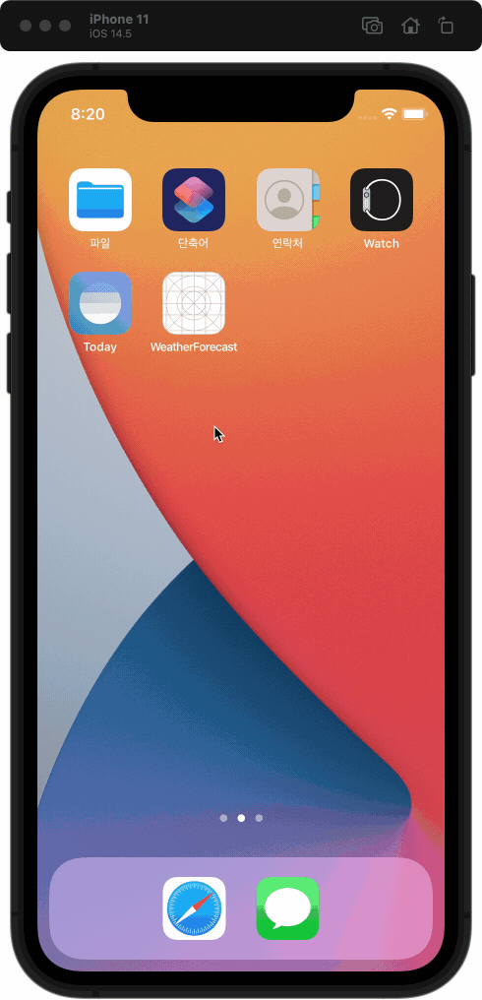

# 날씨 정보 앱

| 📺 데모 | 💡 개요 |
| ------- | ------- |
|  | 🚀 API를 통해 현재 위치의 날씨 정보 표시   &nbsp;&nbsp;&nbsp;&nbsp; - 현재 날씨 정보   &nbsp;&nbsp;&nbsp;&nbsp; - 3시간 단위 5일 예보   🧑🏻‍💻 개인 프로젝트   🗓 진행 기간   &nbsp;&nbsp;&nbsp;&nbsp; 캠프 기간: 2021.01.18 ~ 24   &nbsp;&nbsp;&nbsp;&nbsp; 리팩토링 기간: 2021.09 ~ 10   ⚙️ 기능   &nbsp;&nbsp;&nbsp;&nbsp; `현재 위치의 날씨 정보 표시`   &nbsp;&nbsp;&nbsp;&nbsp; `당겨서 새로고침`   &nbsp;&nbsp;&nbsp;&nbsp; `다크모드 지원`   &nbsp;&nbsp;&nbsp;&nbsp; `다크모드 지원`   &nbsp;&nbsp;&nbsp;&nbsp; `모든 텍스트 크기 지원`   📝 학습 키워드   &nbsp;&nbsp;&nbsp;&nbsp; `MVC`   &nbsp;&nbsp;&nbsp;&nbsp; `CoreLocation`   &nbsp;&nbsp;&nbsp;&nbsp; `URLSession`   &nbsp;&nbsp;&nbsp;&nbsp; `RefreshControl`   &nbsp;&nbsp;&nbsp;&nbsp; `Readable Content Guides`   &nbsp;&nbsp;&nbsp;&nbsp; `Dynamic Type`   &nbsp;&nbsp;&nbsp;&nbsp; `Activity Indicator`|

   

## 목차

1. **프로젝트**
    - [기능](#기능)
    - [그라운드 룰](#그라운드-룰)
    - [GitHub 프로젝트 관리기능 사용해보기](#GitHub-프로젝트-관리기능-사용해보기)
2. **설계 및 구현**
    - [Table View로 화면 구성](#Table-View로-화면-구성)
    - [오토 레이아웃](#오토-레이아웃)
    - [MVC 패턴 사용](#MVC-패턴-사용)
    - [MVC 패턴의 문제 개선 - TableViewDataSource 분리](#MVC-패턴의-문제-개선---TableViewDataSource-분리)
    - [위치 서비스 객체 - LocationManager](#위치-서비스-객체---LocationManager)
    - [날씨 API의 Response 데이터 모델](#날씨-API의-Response-데이터-모델)
    - [네트워킹 객체](#네트워킹-객체)
    - [날씨 이미지 캐싱 - NSCache](#날씨-이미지-캐싱---NSCache)
3. **Human Interface Guidelines으로 앱 개선하기**: HIG를 적용하여 앱의 완성도와 UX를 개선한 내용 정리  
    - [모든 텍스트 크기 지원- Dynamic Type](#모든-텍스트-크기-지원---Dynamic-Type)
    - [큰 화면에서도 가독성 좋은 레이아웃 - Readable Content Guides](#큰-화면에서도-가독성-좋은-레이아웃---Readable-Content-Guides)
    - [다크 모드 지원](#다크-모드-지원)
    - [Launch Screen 적용](#Launch-Screen-적용)
    - [위치 설정으로 이동하는 버튼 제공](#위치-설정으로-이동하는-버튼-제공)
    - [데이터 로딩 표시 - Activity Indicator](#데이터-로딩-표시---Activity-Indicator)
    - [당겨서 새로 고침 - Refresh Control](#당겨서-새로-고침---Refresh-Control)
    - [데이터 로드 실패 처리 - Alert](#데이터-로드-실패-처리---Alert)
4. **트러블 슈팅**: 프로젝트 진행 중 발생한 문제와 해결 방법 정리  
    - [현재 위치 찾는 시간이 느린 문제](#현재-위치-찾는-시간이-느린-문제)
    - [시뮬레이터 변경 후 위치 찾기 안되는 문제](#시뮬레이터-변경-후-위치-찾기-안되는-문제)
    - [배경 이미지가 Table View를 가리는 문제](#배경-이미지가-Table-View를-가리는-문제)
    - [Refresh Control 애니메이션이 먼저 종료된 이후 컨텐츠 업데이트 되는 문제](#Refresh-Control-애니메이션이-먼저-종료된-이후-컨텐츠-업데이트-되는-문제)

   

## 기능

| 현재 위치의 날씨 정보 | 당겨서 새로고침 |
| - | - |
|  |  |

 

| 모든 텍스트 크기 지원 | 다크 모드 지원 |
| - | - |
|  |  |

### [👆목차로 가기](#목차)
   

## 그라운드 룰

혼자 진행하는 프로젝트지만 그라운드 룰을 지키려고 노력했다.

- 휴일(수,토,일) 에는 쉬거나 이전 작업내용을 다시 돌아보기
- 프로젝트 기능 명세서에 충실하기
    - 기능 명세서 내용을 충실하게 먼저 완료하기
    - 이후 시간이 남으면 추가 구현

### 프로젝트 규칙

- 코딩 컨벤션
    - Swift API 디자인 가이드라인을 따르려고 노력하기
    - 클래스, 함수, 변수 명을 명확하고 객관적인 이름으로 하기
    - 가능한 주석 없이 이해가능한 코드 추구하기
- 브랜치 단위 (캠프 기간)
    - 스텝별로 브랜치 만들어서 작업하기 (ex: "step-1", "step-2")
    - 각 스텝의 기능단위로 하위 브랜치 만들고 완료되면 스텝 브랜치로 머지
    - 스텝완료되면 브랜치를 원본 저장소로 PR 보내고 코드 리뷰 받기
- 브랜치 단위 (리팩토링 기간)
    - 작업 단위 별로 issue를 등록하고 브랜치 이름에 이슈 번호를 포함하여 등록
    - 예: issue/2-Networking

### 커밋 메시지 규칙

- 한글로 작성하기
- Title
    - issue 번호를 대괄호로 붙이기
    - 양식: [issue번호] 작업 내용
    - 예시: [#2] - APIClient 구현
- Description
    - Title은 간단하게 Description은 상세하게
    - Title만으로 설명이 충분하면 Description은 없어도 됨
    - Title에서 한칸 빈칸을 띄우고 작성

### GitHub 프로젝트 관리기능 사용해보기

#### Issue 트랙킹을 활용한 작업 순서

1. 작업할 내용을 `Issue`로 등록
2. 부여된 `Issue` 번호와 작업 제목으로 브랜치 생성
3. 해당 `Issue`와 관련된 커밋은 커밋 메시지에 대괄호에 `Issue` 접두사 추가
4. 작업 완료되면 메인 브랜치로 PR하며 코멘트에 `close #Issue번호` 추가하여 머지되면 자동으로 `Issue` close.
5. 해당 PR 셀프 리뷰 후 Merge

#### 참고 링크

- [github 하나로 1인 개발 워크플로우 완성하기: 이론편](https://www.huskyhoochu.com/issue-based-version-control-101)
- [github 하나로 1인 개발 워크플로우 완성하기: 실전 편](https://www.huskyhoochu.com/issue-based-version-control-201/#open-issue)
- [좋은 git 커밋 메시지를 작성하기 위한 8가지 약속](https://djkeh.github.io/articles/How-to-write-a-git-commit-message-kor/)
- 이슈와 프로젝트 기능 활용
- 작업 시작전에 이슈 꼭 등록하고 커밋메세지에 이슈번호 포함!

### 기타 참고 링크

- [How to simulate poor network conditions on iOS Simulator and iPhone](https://medium.com/macoclock/how-to-simulate-poor-network-conditions-on-ios-simulator-and-iphone-faf35f0da1b5)
    - 시뮬레이터에서 네트워크 테스트하려면 Network Link Conditioner 사용
    - 아이폰에서는 설정 - 개발자에서 사용가능
- [View 디버깅시 뷰 객체 찾기]((http://minsone.github.io/mac/ios/quickly-searching-view-when-debug-view-hierachy))

[👆목차로 가기](#목차)
   

## Table View로 화면 구성

### 🔍 구현할 화면 구조 파악

- 날씨 정보를 보여주는 화면 1개
- 화면 전체 세로 스크롤
- 상단에 `현재 날씨` 정보 표시
- `현재 날씨` 아래에 `5일 예보`를 3시간 단위로 표시

### 💡 구현 방법 결정

- 화면 전체를 Table View로 구성
    - Table View 선택 이유: `세로 방향`으로 스크롤 되며 컨텐츠가 `행`으로 반복되며 하나의 `열`만 존재
- Table View는 Section 2개로 구성
    - Section 0: 현재 날씨 cell 표시
    - Section 1: 5일 예보 cell 표시
- 다른 구현 방법
    - 현재 날씨는 1개만 표시되므로 Header에 표시하고, 5일 예보만 cell로 만들어  Section 1개로 구성
- 결정 이유
    - 현재 날씨를 cell로 구현하고 여러 Section을 사용하게 구성해두면, 이후 앱 기능이 변경되거나 추가될 때 쉽게 재사용할 수 있겠다고 생각했다.

### [👆목차로 가기](#목차)
   

## 오토 레이아웃

### 구현 목표

- 스토리보드 사용하지 않고 코드로만 오토 레이아웃 작성
- 다이나믹 타입 지원하여 모든 텍스트 크기 지원
- 컨텐츠 크기에 따라 `Cell` 높이 자동 조절
- [UIFont - Creating Self-Sizing Table View Cells](https://developer.apple.com/documentation/uikit/uifont/creating_self-sizing_table_view_cells) 문서를 참고하여 셀프 사이징 셀 구현

### CurrentWeatherCell 레이아웃

- 수평 레이아웃
    - leading/trailing: readableContentGuide에 맞추었다.
    - iconImageView를 수평의 기준으로 잡고 먼저 배치하고 너비는 readableContentGuide에 비례 축소했다.
    - Label은 모두 같은 너비를 주어도 되므로 addressLabel로 기준 잡고 나머지를 맞추었다.
- 수직 레이아웃
    - 셀프 사이징 셀을 구현하기 위해 first/baseLineAnchor로 컨텐츠 상/하단의 cosntraint을 주었다.

### FiveDayForeCastCell 레이아웃

- 수평 레이아웃
    - leading/trailing: readableContentGuide에 맞추었다.
    - 좌측 Label부터 배치하고, iconImageView의 너비는 readableContentGuide에 비례 축소했다.
- 수직 레이아웃
    - 셀프 사이징 셀을 구현하기 위해 first/baseLineAnchor로 컨텐츠 상/하단의 cosntraint을 주었다.

### equalToSystemSpacingBelow의 값 기준?

[UIFont - Creating Self-Sizing Table View Cells](https://developer.apple.com/documentation/uikit/uifont/creating_self-sizing_table_view_cells) 문서의 예제가 `equalToSystemSpacingBelow`를 사용하는데, 이것이 무엇을 기준으로 값을 변경하는지 알아보고 테스트했다.

#### 테스트 결과

- iPhone 11 / Text Size 4
    - dateLabel.firstBaseline = Layout Margin.top + 28
    - Layout Margins.bottom = label.lastBaseline + 14
- iPhone 11 / Text Size 10
    - dateLabel.firstBaseline = Layout Margin.top + 59.5
    - Layout Margins.bottom = label.lastBaseline + 29.5
- 결론: 폰트 (텍스트 사이즈) 설정에 따라 결정됨
    - [constraint(equalToSystemSpacingBelow:multiplier:)](https://developer.apple.com/documentation/uikit/nslayoutyaxisanchor/2866022-constraint) 문서를 보면 system spacing 값은 앵커에서 사용 가능한 정보에 따라 결정되는데, 그 예로 앵커가 text baseline이라면 spacing은 해당 baseline에서 사용된 글꼴에 따라 결정된다고 써있다.
    - 그래서 텍스트 크기를 변경하면 다이나믹 타입이 적용된 경우 시스템에서 텍스트의 크기를 알 수 있으므로 이를 기준으로 스페이싱을 결정한다.

### [👆목차로 가기](#목차)
   

## MVC 패턴 사용

- MVC 패턴의 핵심은 `Model`과 `View`가 직접 소통하지 않고, `Controller`가 중간에서 이들의 소통을 관리하는 것이며, 이 핵심을 최대한 지키기 노력했다.
- 공식 문서 [Cocoa Core Competencies - MVC](https://developer.apple.com/library/archive/documentation/General/Conceptual/DevPedia-CocoaCore/MVC.html#//apple_ref/doc/uid/TP40008195-CH32-SW1)를 참고하여 MVC 패턴으로 프로젝트를 설계했다.

### 🔍 MVC 패턴을 선택한 이유

- MVC 외에 MVP, MVVM 등 다양한 아키텍처 패턴이 있지만, 애플에서 권장하는 기본 MVC 패턴부터 제대로 알고 경험해 봐야 다른 아키텍처와의 차이점과 장단점을 알 수 있겠다는 생각에 MVC 패턴을 사용하기로 결정했다.

### 📝 공식 문서로 MVC 알아보기

- 애플이 채택한 MVC는 기존에 통용되던 MVC 패턴과는 살짝 다르며 이에 대해 공식 문서에서 설명하고 있다.
- [Cocoa Core Competencies - MVC](https://developer.apple.com/library/archive/documentation/General/Conceptual/DevPedia-CocoaCore/MVC.html#//apple_ref/doc/uid/TP40008195-CH32-SW1)
    - MVC 패턴은 앱의 객체에 Model, View, Controller 3가지 역할 중에 하나를 할당하며, 객체의 역할뿐 아니라 서로 통신하는 방식을 정의한다.
    - MVC는 Cocoa 애플리케이션에 적합한 설계를 위한 핵심이다. 이 애플리케이션의 많은 객체는 재사용하기 더 쉬우며, 인터페이스가 더 잘 정의된다.
    - MVC로 설계된 애플리케이션은 다른 애플리케이션보다 쉽게 확장 가능하다.
    - 많은 Cocoa 기술과 아키텍처는 MVC에 기반하며 당신의 커스텀 객체도 MVC 역할 중 하나가 요구된다.
    - Model
        - Model은 데이터를 캡슐화하며 데이터를 다루고 처리하는 로직과 계산을 정의한다.
        - Model은 다른 Model과 하나 또는 여러 관계를 가질 수 있다.
        - 이상적으로 Model은 View와 명시적으로 연결되어 있지 않아야 한다.
        - 데이터를 생성하거나 수정하는 View의 유저 액션은 Controller를 통해 전달되며 Model을 만들거나 업데이트한다. 
        - Model이 변경될 때(예를 들면, 네트워크 연결로 새로운 데이터가 수신됐을 때), Model은 Controllr에 알려서 적절한 View를 업데이트한다.
    - View
        - 사용자가 앱에서 볼 수 있는 객체.
        - 자신을 그리는 방법을 알며, 사용자 액션에 반응할 수 있다.
        - 주요 목적은 앱의 Model로부터 데이터를 표시하는 것, 데이터의 수정을 허용하는 것
        - View는 Model과 일반적으로 비결합이어야 한다.
        - View는 Controller를 통해 Model 데이터의 변화에 대해 알고, 사용자의 변경 사항을 모델에 전달한다.
    - Controller
        - Controller는 View와 Model 사이를 중개한다.
        - Controller는 View가 만드는 유저 액션을 해석하며 모델 레이어에 새로 추가되거나 변경된 데이터를 전달한다.
        - Model이 변경될 때, Controller는 새로운 Model 데이터를 View에 전달하여 표시되게 한다.

### [👆목차로 가기](#목차)
   

## MVC 패턴의 문제 개선 - TableViewDataSource 분리

애플의 MVC 패턴은 ViewController가 너무 커지는 문제가 있고, 이를 Massive-View-Controller라고 불린다.
  
이 프로젝트에서도 화면 1개를 담당하는 WeatherForeastViewController이 유일한 Controller이며 이 오브젝트 하나로 모든 View와 Model을 관리해야한다. 

애플의 MVC 패턴을 준수하면서 이 문제를 개선할 방법을 생각해봤다.

### UITableViewDataSource 객체 분리

UITableViewDataSource는 Table View의 데이터를 관리하는 오브젝트다.
  
ViewController에서 직접 Table View의 데이터를 관리한다면 아래의 모습일 것이다.

~~~swift
class WeatherForecastViewController: UITableViewcontroller, UITableViewDataSource {
    // Table View에 사용할 데이터 모델 프로퍼티 필요

    override func viewDidLoad() {
        super.viewDidLoad()

        // tableView의 데이터소스로 이 ViewController를 등록
        tableView.dataSoure.self
    }

    // UITableViewDataSource 메서드
    func numberOfSections(in tableView: UITableView) -> Int {
    }

    func tableView(_ tableView: UITableView, numberOfRowsInSection section: Int) -> Int {
    }

    func tableView(_ tableView: UITableView, cellForRowAt indexPath: IndexPath) -> UITableViewCell {
    }
}
~~~

UITableViewDataSource의 역할을 ViewController가 하도록 구성되어 Table View 데이터를 관리하는 세세한 메서드를 모두 여기서 작성해야 하므로 ViewController의 역할과 코드가 늘어났다.  
  
그리고 만약 UITableViewDataSource 외에도 다른 기능이 이런식으로 추가된다면 ViewController는 계속해서 비대해진다.
  
이제 UITableViewDataSource를 ViewController와 분리해서 개선해보자.  

~~~swift
class WeatherForecastViewController: UITableViewController {
    private lazy var dataSource: WeatherForecastDataSource = {
        let dataSource = WeatherForecastDataSource(dataLoadedAction: {
            DispatchQueue.main.async {
                // 데이터 로드되면 실행되는 View 업데이트 등록
            }
        }, dataRequestFailedAction: {
            DispatchQueue.main.async {
                // 데이터 요청 실패하면 실행되는 View 업데이트 등록
            }
        })
        dataSource.registerCells(with: tableView)
        return dataSource
    }()

    private func configureTableViewAndDataSource() {
        // tableView의 데이터소스로 등록
        tableView.dataSource = dataSource
    }
}
~~~

- Table View의 데이터 관리 역할은 WeatherForecastDataSource로 분리하여 구체적인 데이터 관리는 WeatherForecastDataSource 내부에서 수행된다.
- WeatherForecastDataSource는 데이터를 관리하다가 필요할 때만 ViewController에 Callback 메서드를 통해 알려(Notify) 준다.
- ViewController는 WeatherForecastDataSource가 알려(Notify) 줄 때, View를 업데이트할 내용을 정의하면 된다.

개선 후 Model-Controller 사이의 커뮤니케이션은 아래와 같다.

### [👆목차로 가기](#목차)
   

## 위치 서비스 객체 - LocationManager

- 위치 서비스는 CLLocatiomManager로 사용할 수 있다.
- 위치 서비스 관리 역할을 담당하는 `LocationManager` 객체를 만들어서 ViewController와 분리하여 MVC 패턴을 준수했다.
- 커스텀 객체 `LocationManager`을 만들고 `CLLocationManager`을 상속한다.
- `CLLocationManagerDelegate` 프로토콜을 추가하고, `LocationManager`에 위임한다.

~~~swift
import CoreLocation

class LocationManager: CLLocationManager {
    init() {
        super.init()
        delegate = self
    }
}

extension LocationManager: CLLocationManagerDelegate {
}
~~~

### 현재 위치 찾기 흐름

1. 사용자에게 위치 권환 요청
    - `requestWhenInUseAuthorization()` 메서드 사용
    - 현재 위치 정보가 계속 필요하지 않기에 `requestAlwaysAuthorization()`보다 `requestWhenInUseAuthorization()`이 맞다고 생각했다.
2. 현재 위치 요청 
    - `requestLocation()` 메서드로 한 번만 요청한다.
    - `startUpdatingLocation()`으로 위치 정보를 계속 받을 수 있지만, 위치 정보 하나면 충분하다 생각해서 `requestLocation()`을 선택했다.
3. 위치 데이터 받기
    - 위치 데이터가 업데이트되면 델리게이트 메서드 `locationManager(_:didUpdateLocations:)`를 통해 `CLLocaion`이 전달된다.
    - 전달된 `CLLocation`데이터를 콜백 메서드 `locationUpdatedAction()`을 통해 `ViewController`에 전달한다.
4. 에러 처리
    - 위치 요청이 실패하면 델리게이트 메서드 `locationManager(_:didFailWithError:)`를 통해 `Error`가 전달된다.
    - Error 종류에 따라서 적절한 처리를 하도록 `ViewController` 콜백 메서드로 알려준다.
    - 위치 권한 거절 에러는 `ViewController`에서 사용자에게 다시 위치 권한을 요청한다.
    - 그 외 에러는 위치 데이터 로드 실패 메시지를 보여준다.

### [👆목차로 가기](#목차)
   

## 날씨 API의 Response 데이터 모델

날씨 데이터는 [OpentWeather](https://openweathermap.org/)에서 제공하는 API중 2개를 사용한다.
- 현재 날씨 API: [Current Weather Data API](https://openweathermap.org/current)
- 5일 예보 API: [5 Day / 3 Hour Forecast API](https://openweathermap.org/forecast5)

### 모델 타입 구현

- [Current Weather Data API](https://openweathermap.org/current)의 Response 데이터 모델: CurrentWeatherData
- [5 Day / 3 Hour Forecast API](https://openweathermap.org/forecast5)의 Response 데이터 모델: FiveDayForecastData

~~~swift
struct CurrentWeatherData: Decodable {
    let coordinate: CLLocationCoordinate2D
    private let weathers: [Weather]
    var weather: Weather {
        return weathers[0]
    }
    let temperature: Temperature
    let utc: Int
    let cityID: Int
    let cityName: String
    
    enum CodingKeys: String, CodingKey {
        case coordinate = "coord"
        case weathers = "weather"
        case temperature = "main"
        case utc = "dt"
        case cityID = "id"
        case cityName = "name"
    }
}

~~~

- API의 Response 데이터는 JSON 포맷이며, 이를 Decode해야 하므로 Decodable 프로토콜을 채택한다.
    - Codable 프로토콜이 Encodable과 Decodable을 모두 채택하므로 사용할 수 있지만, Decode 기능만 필요하므로 필요 없는 기능은 빼고, Decode만 사용하는 객체라는 것을 명시적으로  나타내기 위해 Decodabl을 채택했다.
- API 문서에는 프로퍼티가 더 많지만, 모든 프로퍼티를 사용하지는 않으므로 앱에 꼭 필요한 정보만 정의했다.
- 프로퍼티의 네이밍이 Swift의 네이밍 스타일과는 다르므로 CodingKeys를 사용하여 다시 네이밍 했다.
- CurrentWeatherData와 FiveDayForecastData는 공통된 정보가 많다. 이러한 정보는 하위 모델을 따로 만들어서 재사용했다.

### 데이터 모델 Unit Test

- 현한 날씨 데이터 모델이 JSON 타입을 제대로 Decode 하는지 Unit Test를 통해 검증해 보았다.
- 테스트할 JSON 예시 데이터를 만들고 에셋에 추가해두었다.

~~~swift 
func testDecodeResponseDataOfCurrentWeatherAPI() {
        // Given-When-Then (준비-실행-검증)
        // Given
        guard let dataAsset = NSDataAsset(name: "ExampleResponseOfCurrentWeather") else {
            XCTFail("Failed to load dataAsset")
            return
        }
        let jsonDecoder = JSONDecoder()
        let decodedData: CurrentWeatherData
            
        do {
            // When
            decodedData = try jsonDecoder.decode(CurrentWeatherData.self, from: dataAsset.data)
            
            // Then
            XCTAssertEqual(decodedData.coordinate.longitude, -122.08)
            XCTAssertEqual(decodedData.coordinate.latitude, 37.39)
            
            XCTAssertEqual(decodedData.weather.conditionID, 800)
            XCTAssertEqual(decodedData.weather.group, "Clear")
            XCTAssertEqual(decodedData.weather.description, "clear sky")
            XCTAssertEqual(decodedData.weather.iconID, "01d")
            
            XCTAssertEqual(decodedData.temperature.currentCelsius, 282.55)
            XCTAssertEqual(decodedData.temperature.humanFeelsCelsius, 281.86)
            XCTAssertEqual(decodedData.temperature.minimumCelsius, 280.37)
            XCTAssertEqual(decodedData.temperature.maximumCelsius, 284.26)
            XCTAssertEqual(decodedData.temperature.atmosphericPressure, 1023)
            XCTAssertEqual(decodedData.temperature.humidity, 100)
            
            XCTAssertEqual(decodedData.utc, 1560350645)
            XCTAssertEqual(decodedData.cityID, 420006353)
            XCTAssertEqual(decodedData.cityName, "Mountain View")
        } catch {
            XCTFail("\(error.localizedDescription)")
        }
    }
~~~

1. 데이터 에셋에서 테스트할 JSON 예시 데이터를 로드한다. 
2. JSONDecoder를 사용하여 해당 데이터를 Decode 한다.
3. Decode된 데이터가 JSON 예시 데이터의 값과 일치하는지 테스트한다.
4. 값이 모두 일치하면 통과하며, 하나라도 다르면 실패한다.

### 모델 리팩토링

프로젝트를 다시보며 모델 타입의 리팩토링이 필요하다고 생각되어 진행했다.

#### 1. 하위 모델 통합

모델마다 구조체로 분리했더니 날씨 데이터 모델 파일만 7개다.

~~~
// 리팩토링 전 모델

Model
- CurrentWeather.swift
- WeatherForecast.swift

SubModel
- Coordinate.swift
- Weather.swift
- temperature.swift
- WeatherForecastItem.swift
- City.swift
~~~

이러다 보니 모델의 프로퍼티에 사용된 서브모델의 내용을 보려면 해당 파일을 열고 확인해야 해서 내용을 파악하기가 불편하다는 생각이 들었다.  
  
API Reponse 명세서를 다시 확인하여 `CurrentWeather`와 `WeatherForecast` 두 모델에서 공통적으로 사용되는 서브모델인 `Coordinate`, `Weather`, `temperature`는 남기고, 각 모델에서만 사용하는 서브모델은 해당 모델에서 정의하는 것으로 변경해서 모델의 구성을 좀 더 알아보기 쉽게 리팩토링했다.  
  
또, API Response로 전달받는 `데이터`라는 의미를 명확하게 해주기 위해 각 API 모델의 뒤에 `Data`를 붙여주었다.

~~~
// 리팩토링 후 모델

Model
- CurrentWeatherData.swift
- WeatherForecastData.swift
    - Item
    - City

SubModel
- Coordinate.swift
- Weather.swift
- temperature.swift
~~~

#### 2. JSON 데이터의 `Weather` 항목

이유는 모르지만 API Response JSON 데이터의 `Weather` 항목이 원소가 1개만 있는 배열로 구성된다.

~~~json
{
  "weather": [
    {
      "id": 800,
      "main": "Clear",
      "description": "clear sky",
      "icon": "01d"
    }
  ],
}
~~~

그러므로 `Weather` 배열은 첫 번째 원소에만 접근해야 한다는 것을 모델 코드만 보고도 유추가 가능하고, 안전하게 사용할 수 있도록 배열에는 `private` 접근 제한을 하고 첫 원소만 반환하는 프로퍼티를 추가했다.

~~~swift
struct CurrentWeatherData: Decodable {
    private let weathers: [Weather]
    var weather: Weather? {
        return weathers.first
    }
}
~~~

### [👆목차로 가기](#목차)
   

## 네트워킹 객체

| 객체 | 설명 |
| ---- | ---- |
| APIClient | - API에 직접 데이터를 요청하는 최하단 객체   - baseURL과 query로 URL을 만들어 해당 URL의 데이터를 요청하고 로드한다.   - OpenWeahter뿐 아니라 다른 API가 추가되더라도 사용할 수 있도록 고려했다. |
| APIClientError | - APIClient의 데이터 요청 과정에서 발생할 수 있는 에러 정의 | 
| OpenWeatherAPI | - 사용할 API의 URL, apiKey, 단위, 언어 등을 미리 정의하여 OpenWeather의 API 요청을 간단히 하기 위한 객체   - APIClient를 사용하여 요청한다.   - OpenWeatehrAPI를 쉽게 사용하도록 요청 파라미터를 정의했다.  |
| OpenWeatherAPIConstants | - API 종류에 따라 요청 파라미터를 상수화해서 사용하기 쉽게 하기 위한 객체 |

### APIClient

- URLSession의 `dataTask(with:completionHandler:)`를 사용하여 데이터 요청 및 로드
    - URLSession의 Task는 dataTask(), uploadTask(), downloadTask(), streamTask() 등 다양하지만 API의 데이터 요청에는 dataTask()가 적합하다고 생각했다. 
        - uploadTask(): 데이터를 업로드하기 위한 요청 작업
        - downloadTask(): 데이터의 다운로드를 요청하는 작업이므로 비슷하지만 dataTask()보다는 훨씬 큰 규모의 데이터를 다운로드하는데 적합한 작업이라 생각햇다.
- completionHandler로 Result 객체를 통해 요청 성공 또는 실패 시 반환할 데이터를 구분했다. 
    - Success
        - Decodable 프로토콜을 채택한 제네릭 타입을 사용하여 Decodable을 준수하는 모델 타입은 모두 사용할 수 있도록 했다.
        - 로드된 데이터는 decode 하여 지정한 모델 타입으로 전달한다.
    - Failure: 실패할 경우 APIClientError로 정의된 에러 케이스를 전달한다.

~~~swift
struct APIClient<ResponseData: Decodable> {
    let baseURL: String
    let queryItems: [URLQueryItem]?
    
    private var url: URL? {
        var urlComponents = URLComponents(string: baseURL)
        urlComponents?.queryItems = queryItems
        return urlComponents?.url
    }
    
    init(baseURL: String, queryItems: [URLQueryItem]? = nil) {
        self.baseURL = baseURL
        self.queryItems = queryItems
    }
    
    private func decodeData(from: Data) -> ResponseData? {
        return try? JSONDecoder().decode(ResponseData.self, from: from)
    }
    
    private func checkResponse(with statusCode: Int) throws {
        switch statusCode {
        case 200...299:
            break // success
        case 400...499:
            throw APIClientError.clientError
        case 500...599:
            throw APIClientError.serverError
        default:
            throw APIClientError.unknownResponse
        }
    }
    
    func request(completionHandler: @escaping (Result<ResponseData, APIClientError>) -> Void) {
        guard let url = url else {
            completionHandler(.failure(.invalidURL))
            return
        }
        
        let task = URLSession.shared.dataTask(with: url) { data, response, error in
            guard let data = data,
                  let httpResponse = response as? HTTPURLResponse,
                  error == nil else {
                completionHandler(.failure(.requestFailed))
                return
            }
            
            do {
                try checkResponse(with: httpResponse.statusCode)
            } catch let apiClientError as APIClientError {
                completionHandler(.failure(apiClientError))
                return
            } catch {
                completionHandler(.failure(.unknown))
                return
            }
                        
            if let decodedData = decodeData(from: data) {
                completionHandler(.success(decodedData))
            } else {
                completionHandler(.failure(.jsonError))
            }
        }
        task.resume()
    }
}
~~~

### OpenWeatherAPI

- OpenWeather의 API로 데이터 요청 시 필요한 옵션 값을 쉽게 넣을 수 있게 설계했다.
- API의 주소에 쿼리로 apiKey와 위도, 경도 정보를 추가하여 해당 위치의 데이터를 요청하게 된다.
- 실제 요청은 APIClient 객체를 사용하므로 completionHandler는 동일하게 제네릭으로 구성했다.

~~~swift
struct OpenWeatherAPI<ResponseData: Decodable> {
    var baseURL: String
    var apiKey: String
    var units: Units?
    var language: Language?
    var count: Int?
    
    private func queryItems(coordinate: CLLocationCoordinate2D) -> [URLQueryItem] {
        var queryItems = [URLQueryItem]()
        queryItems += [URLQueryItem(name: "lat", value: "\(coordinate.latitude)"),
                       URLQueryItem(name: "lon", value: "\(coordinate.longitude)"),
                       URLQueryItem(name: "appid", value: apiKey),]
        if let units = units {
            queryItems.append(units.queryItem())
        }
        if let language = language {
            queryItems.append(language.queryItem())
        }
        if let count = count {
            queryItems.append(URLQueryItem(name: "cnt", value: "\(count)"))
        }
        return queryItems
    }
  
    func request(by coordinate: CLLocationCoordinate2D, completionHandler: @escaping (Result<ResponseData, APIClientError>) -> Void) {
        let queryItems = queryItems(coordinate: coordinate)
        let apiClient = APIClient<ResponseData>(baseURL: baseURL, queryItems: queryItems)
        apiClient.request() { result in
            switch result {
            case .success(let data):
                completionHandler(.success(data))
            case .failure(let error):
                completionHandler(.failure(error))
            }
        }
    }
}
~~~

### 네트워킹 객체 리팩토링 전

- 문제점 파악
    - completionHandler의 Result 객체에 제네릭을 적용하지 않아서 메서드를 재사용하지 못하고, API마다 메서드를 정의해야 했다.
    - API마다 요청에 필요한 옵션 쿼리 값이 다른데, 이를 하드코딩했다.
    - 네트워크 에러도 각 API의 nested type이라 동일한 에러도 다르게 처리해야 했다.

~~~swift
func getData(coordinate: CLLocationCoordinate2D, completionHandler: @escaping (Result<CurrentWeatherData, APIError>) -> Void) {
    guard let url = URL(string: "\(baseURL)lat=\(coordinate.latitude)&lon=\(coordinate.longitude)&units=metric&appid=\(apiKey)") else {
        completionHandler(.failure(.invalidURL))
        return
    }
    
    let dataTask = urlSession.dataTask(with: url) { data, _, error in
        if let error = error {
            print(error.localizedDescription)
            completionHandler(.failure(.requestFailed))
            return
        }
        guard let data = data else {
            completionHandler(.failure(.noData))
            return
        }
        
        if let decodedData: CurrentWeatherData = try? JSONDecoder().decode(CurrentWeatherData.self, from: data) {
            completionHandler(.success(decodedData))
        } else {
            completionHandler(.failure(.invalidData))
        }
    }
    dataTask.resume()
}
~~~

### [👆목차로 가기](#목차)
   

## 날씨 이미지 캐싱 - NSCache

| 이미지 캐싱 전 | 이미지 캐싱 후 |
| :-: | :-: |
|  |  |
| Cell 재사용 될 때마다 이미지를 다시 로드 | 로드된 이미지는 캐시에서 빠르게 로드 |

### 🔍 구현할 문제 파악

- API의 Response 데이터는 날씨 아이콘 이미지 데이터가 아닌 `iconID`를 제공한다.
- 날씨 이미지의 URL은 따로 제공되므로 URL의 뒤에 `iconID`를 붙여 로드한다.
- Table View는 cell을 재사용하므로, 밑으로 스크롤 후 돌아오면 `Image View`는 필요한 이미지를 다시 URL에 요청하여 로드한다.
- 로드했던 이미지를 매번 다시 로드하는 것은 성능과 자원 낭비이므로 캐시를 사용하여 최초에만 이미지를 로드하고 이후에는 재사용해야 한다.

### 메모리 캐싱 vs 디스크 캐싱

- 메모리 캐싱
    - 앱의 메모리 영역에 캐싱되어 앱이 종료되면 캐싱된 데이터는 사라진다. (앱 재시작하면 다시 데이터 로드 필요)
    - 시스템이 자동으로 관리하므로 신경 쓰지 않아도 된다.
- 디스크 캐싱
    - 앱의 디스크 영역에 저장하여 앱을 재시작해도 데이터를 사용할 수 있다. (앱 재시작해도 캐시된 데이터 사용 가능)
    - 앱이 차지하는 용량이 점점 커지므로 관리 필요.
- 메모리 캐싱으로 결정
    - 두 방법은 장단점이 있고, 두 방법을 같이 사용할 수도 있다.
    - 앱에 사용되는 이미지는 작은 크기라 메모리 캐싱만으로 충분하다고 생각했다.

### 구현

이미지 로드 기능을 담당하는 `ImageLoader` 객체를 구현하고 이미지 캐싱을 적용했다.
  
#### 이미지 로드 흐름

1. ImageLoader.load() 메서드 호출
2. URL 체크
3. URL을 key 값으로 캐시에 저장된 이미지 있는지 체크
4. 캐시에 있다면 캐시에서 가져온 이미지를 completionHandler로 전달 후 리턴
5. 캐시에 없다면 URL로 이미지 로드 요청
6. 이미지 로드 완료되면 캐시에 URL을 key 값으로 이미지 캐싱
7. completionHandler로 이미지 전달 후 리턴

~~~swift
struct ImageLoader {
    static private var imageCache = NSCache<NSString, UIImage>()

    let url: String
    
    func load(completion: @escaping (Result<UIImage, ImageLoaderError>) -> Void) {
        // 0. URL 체크
        guard let url = URL(string: self.url) else {
            completion(.failure(.invalidURL))
            return
        }
        
        // 1. 캐시에 이미지 있으면 가져오기
        let cacheKey = NSString(string: self.url)
        if let cachedImage = Self.imageCache.object(forKey: cacheKey) {
            DispatchQueue.main.async {
                completion(.success(cachedImage))
            }
            return
        }
        
        // 2. 캐시에 이미지 없으면 url로 요청
        URLSession.shared.dataTask(with: url) { data, response, error in
            guard (response as? HTTPURLResponse)?.statusCode == 200,
                  error == nil,
                  let data = data,
                  let image = UIImage(data: data) else {
                completion(.failure(.unknown))
                return
            }
            // 3. 받아온 이미지 캐싱
            Self.imageCache.setObject(image, forKey: cacheKey)
            DispatchQueue.main.async {
                completion(.success(image))
            }
        }.resume()
    }
}
~~~

### 이미지 캐싱 필요 없는 경우

- 사실 위 코드에서는 이미지 캐싱 처리를 따로 안 해도 된다.  
    - 왜? **URLSession.shared** 인스턴스를 사용하기 때문에.
    - URLSession.shared는 기본적인 URLCache를 지원하기 때문에 특별한 처리 없이 메모리와 디스크 캐시가 자동으로 된다.
- 그럼에도 구현한 이유
    - 특별한 인증이나 캐시 처리된 서버로의 요청이 아니라면 URLSession을 커스터마이징하지 않고 기본 URLSession을 사용해도 된다.
    - 현업에서는 커스텀 URLSession을 사용하는 경우도 있고, 여러 데이터에 캐싱 처리가 필요할 수도 있으므로 NSCahce로 캐싱 처리를 경험하려 했다.
- 위 데모 영상은 캐싱 처리 전후를 확실히 비교해 보기 위해 URLSessionConfiguration을 ephemeral로 설정하여 URLCache를 사용하지 않는 환경의 영상이다.

### [👆목차로 가기](#목차)
   

## 모든 텍스트 크기 지원 - Dynamic Type

### 📺 데모와 설명

 

- Dynamic Type 지원하여 텍스트 작거나 크게 변경해도 컨텐츠를 읽을 수 있게 레이아웃 했다.

### 🔍 개선할 문제 파악

- 코드로 오토 레이아웃을 구현하려는데 Table View Cell을 어떻게 구성해야 할까?
- 저시력이나 노안으로 텍스트를 크게 설정하는 경우에도 컨텐츠를 볼 수 있게 하려면?

### 📝 HIG와 공식 문서에서 개선 방안 찾기

- [HIG - Accessibility - Text Size and Weight](https://developer.apple.com/design/human-interface-guidelines/accessibility/overview/text-size-and-weight/)
    - 포괄적(Inclusive)인 앱을 설계할 때는 명확성과 가독성을 위해 **텍스트 크기,** 무게, **레이아웃**을 신경써야한다.
    - **Dynamic Type**을 사용하고 앱의 레이아웃이 모든 폰트 크기에 적응하는지 테스트하라.
    - 큰 폰트 크기의 레이아웃을 고려하라.
    - 현재 폰트 크기에 관계없이 일관된 정보 계층을 유지하라.
- [HIG - Typography](https://developer.apple.com/design/human-interface-guidelines/ios/visual-design/typography/)
    - 시스템 폰트로 텍스트 스타일을 사용하면 Dynamic Type과 더 큰 Accessibility type sizes를 지원하게되어, 사용자가 텍스트 크기를 선택하면 작동한다.
    - 가능하면 내장된 텍스트 스타일을 사용하라.
- [UIFont - Creating Self-Sizing Table View Cells](https://developer.apple.com/documentation/uikit/uifont/creating_self-sizing_table_view_cells)
    - Table View Cell에 Dynamic Type을 지원하여 셀프 사이징을 구현하는 예제.

### 💡 개선 방법 결정

- 화면 전체가 Table View로 구성되므로 `UITableViewController`를 사용했다.
- 다이나믹 타입을 지원하면서 모든 크기에서 컨텐츠를 볼 수 있으려면 컨텐츠의 크기에 따라 조절되는 오토 레이아웃을 구현해야 한다.
- Label
    - 앱의 모든 텍스트는 Label로 구현했으므로 해당 Label에 적절한 UIFont.TextStyle을 설정하면 다이나믹 타입이 지원된다.
- Table View Cell
    - Label 폰트에 다이나믹 타입이 적용됐으므로, 텍스트 크기 설정에 따라 Label의 Intrinsic Size가 변경된다. 그러므로 Label의 사이즈 constraint는 직접 설정할 필요 업이 위치 constaint만 설정하면 된다.
    - Cell의 높이는 Label의 BaseLineAnchor에 equalToSystemSpacingBelow로 cosntraint를 설정하여 적절한 높이가 자동으로 계산되도록(셀프 사이징) 했다.

### [👆목차로 가기](#목차)
   

## 큰 화면에서도 가독성 좋은 레이아웃 - Readable Content Guides

### 📺 데모와 설명

- 아이패드처럼 더 큰 화면에서도 컨텐츠를 읽기 편하게 가운데로 오토 레이아웃

### 🔍 개선할 문제 파악

- 오토 레이아웃으로 화면의 레이아웃을 구성할 때 적합한 기준은 무엇일까?
- Layout Margins Guide로 충분한가?

### 📝 HIG와 공식 문서에서 개선 방안 찾기

-  [H.I.G - Adaptivity and Layout](https://developer.apple.com/design/human-interface-guidelines/ios/visual-design/adaptivity-and-layout/)
    - 시스템은 컨텐츠와 읽기에 적합한 제한된 텍스트의 너비에 스탠다드 마진을 적용하기 쉽게 해주는 미리 정의된 layout guide를 포함합니다.
    - 주요 컨텐츠가 기본 크기에서 명확하게 하라. 중요한 텍스트를 읽기위해 가로방향 스크롤을 할 필요가 없게 하라.
    - **더 큰 기기에서 텍스트를 표시할 때 Readability margins을 적용하라**. 이 마진은 편안한 읽기 경험을 보장하기위해 텍스트 라인을 짧게 유지한다.
- HIG에서는 layout guide를 사용하라고 나와있지만 정확히 어떤 프로퍼티를 사용하라는지는 나와있지 않아 애매하다. Auto Layout Guide도 찾아보자.
- [Auto Layout Guide - Working with Constraints in Interface Builder - iOS-Only Features - Readable Content Guides](https://developer.apple.com/library/archive/documentation/UserExperience/Conceptual/AutolayoutPG/WorkingwithConstraintsinInterfaceBuidler.html)
    - 뷰의 readableContentGuide 프로퍼티는 뷰 내부의 텍스트 오브젝트를 위한 최대 적절 너비를 정의하는 layout guide를 포함한다.
    - 이상적으로 컨텐츠는 사용자가 머리를 움직일 필요 없이 읽을 수 있을만 큼 충분히 좁아야 한다.
    - **이 가이드의 사이즈는 시스템의 다Dynamic Type Size에 따라서 달라진다.**
    - 대부분의 기기에서 readable content guides와 layout margins는 거의 또는 전혀 차이가 없다. 아이패드의 가로 방향에서 차이가 분명해진다.
- [UIView - readableContentGuide](https://developer.apple.com/documentation/uikit/uiview/1622644-readablecontentguide)
    - 뷰 안에서 readable한 너비의 영역을 나타내는 레이아웃 가이드.
    - 이 레이아웃 가이드는 사용자가 라인을 따라가기 위해 억지로 머리를 움직일 필요 없이 읽기 쉽게 할 수 있는 영역을 정의한다.

### ⁉️ readableContentGuide와 layoutMarginGuide의 차이 확인

공식 문서를 통해 읽는 컨텐츠에는 readableContentGuide 사용을 권장한다는 것을 알았다. 하지만 구체적인 차이는 설명되지 않아서 예제 프로젝트를 만들어 확인해 봤다.
  
- readableContentGuide는 녹색, layoutMarginGuide는 노란색

- 아이폰의 세로 방향에서는 Dynamic Type Size의 최저, 최고 크기에도 차이점이 없다.  
  

- 아이폰의 가로 방향에서는 차이를 확인할 수 있다.
- readableContentGuide가 layoutMarginGuide보다 작으며 가운데로 배치된 것을 알 수 있다.
- Dynamic Type Size가 작을수록 차이가 커지고, 일정 크기가 넘어가면 차이가 적어지다가 없어진다.

- 아이패드는 가로방향에서 차이가 더 크지만, 세로방향에서도 차이를 확인할 수 있다.
- 아이폰은 큰 기기더라도 세로 화면의 너비가 작아서 차이가 없지만, 아이패드는 세로방향에서도 너비가 넓으므로 차이를 둔다고 생각된다.
- 아이패드에서도 Dynamic Type Size가 일정 크기가 넘어가면 차이가 없어지는데, Dynamic Type Size가 클수록 (텍스트의 크기를 키울수록) 사용자는 기기를 더 멀리서 볼 테니 머리를 움직일 필요가 적어져서 그렇다고 생각된다.

### 💡 개선 방법 결정

- 화면에 컨텐츠 말고 다른 UI 요소가 없고, 컨텐츠가 모두 읽는 정보이므로 readableContentGuide에 맞춰서 레이아웃 하기로 결정했다.
- **readableContentGuide을 사용할 때 장점**으로는 **아이패드 대응**도 간단히 해볼 수 있다는 점이다. 물론 아이패드 화면을 제대로 지원하려면 아이폰과 아이패드 레이아웃을 따로 구성하는 것이 가장 보기 좋겠지만, 개발 시간이 부족하거나, UI가 간단한 화면이라면 readableContentGuide 사용만으로도 사용자가 느끼는 UX는 훨씬 좋아질 것 같다.  
  
| layoutMarginGuide 기준 레이아웃 | readableContentGuide 기준 레이아웃 |
| :-: | :-: |
|  |  |
| 컨텐츠를 한눈에 보기 불편하다 | 컨텐츠를 한눈에 보기 편해졌다 |

### [👆목차로 가기](#목차)
   

## 다크 모드 지원

### 📺 데모와 설명

| 라이트 모드 | 다크 모드 | 라이트/다크 변경 |
| - | - | - |
|  |  |  |
| iOS 12 이하에서 기본 화면   iOS 13 이상에서 라이트 모드 | iOS 13 이상에서 다크 모드 | 라이트/다크 모드 변경 |

### 🔍 개선할 문제 파악

- 다크 모드는 무엇이며 어떻게 지원할 수 있을까?
- 이 앱에서는 어떤 요소에 적용해야 할까?

### 📝 HIG와 공식 문서에서 개선 방안 찾기

- [HIG - Dark Mode](https://developer.apple.com/design/human-interface-guidelines/ios/visual-design/dark-mode/)
    - iOS 13 `설정`에서 다크 모드를 선택할 수 있다. 사용자는 모든 앱이 자신의 설정을 따르길 기대할 것 이다. (라이트/다크 모드를 선택할 수 있으니 사용자는 앱이 당연히 지원할 것이라 생각할 것)
    - 설정에서 선택한 모드를 준수하라. (앱안의 설정을 만들지 말고 시스템 설정을 따르는게 작업도 줄어들고 사용자 입장에서도 자연스러움)
    - 라이트/다크 모드에서 디자인을 테스트하라. (라이트 모드에서 좋은 디자인이라도 다크 모드에서는 이상할 수 있음)
    - 현재 모드에 적응하는 다이나믹 컬러를 사용하라. 하드 코딩된 컬러 값이나 적응하지 않는 컬러는 피하라. (Semantic color를 사용하면 현재 모드에 자동으로 적응할 수 있다.)
    - Label에는 시스템 제공하는 label color를 사용하라. (현재 모드에 자동으로 적응)
- [HIG - Color](https://developer.apple.com/design/human-interface-guidelines/ios/visual-design/color/)
    - 시스템 컬러를 사용하면 라이트/다크 모드를 자동으로 지원할 수 있음 (같은 색이라도 모드별로 색상 값이 살짝 다르다)
    - semantic color로 Label, Placeholder text, link 등의 색상이 정의되어 자동으로 다크 모드를 지원한다.
- [Providing Images for Different Appearances](https://developer.apple.com/documentation/uikit/uiimage/providing_images_for_different_appearances) (이미지에 다크 모드 지원하기)
    - different appearances를 관리하는 좋은 방법은 에셋 카탈로그를 사용하는 것
    - 시스템이 자동으로 현재 설정에 맞는 적절한 이미지를 그린다. 설정을 변경하면 새로운 설정으로 다시 그린다

### 💡 개선 방법 결정

- 다크 모드 지원이 필요한 요소
    - 배경 이미지
    - Table View
    - Label

#### 1. 배경 이미지 - 에셋 카탈로그 사용

배경 이미지를 라이트/다크 모드로 나누어 에셋 카탈로그에 Imges Set으로 등록한다.

이제 배경 이미지 에셋의 이름 `Desert_Tree`를 사용하면 시스템이 자동으로 라이트/다크 모드에 맞는 이미지를 그린다.

~~~swift
private let backgroundImageView: UIImageView = {
    let imageView = UIImageView()
    imageView.image = UIImage(named: "Desert_Tree")
    imageView.contentMode = .scaleAspectFill
    return imageView
}()
~~~

#### 2. Table View - 백그라운드 뷰 설정

테이블 뷰의 백그라운드 뷰로 `1`의 이미지 뷰를 설정해주면 간단하다.

~~~swift
tableView.backgroundView = backgroundImageView
~~~

테이블 뷰의 구분선인 `separator`는 `semantic color`가 기본값이므로 추가 작업이 필요 없다.

#### 3. Label - 추가 작업 불필요

이 앱의 텍스트는 모두 Label로 구현했다.  
Label은 텍스트 컬러의 기본값은 자동으로 다크 모드를 지원하는 `semantic color`인 `Label`이므로 추가 작업이 필요 없다.

### [👆목차로 가기](#목차)
   

## Launch Screen 적용

### 📺 데모와 설명

| 데모 | 느리게 보기 | 적용 전 느리게 보기 |
| - | - | - |
|  |  |  |

- Launch Screen을 적용하면 앱이 실행되는 애니메이션의 첫 장면부터 앱의 첫 화면과 같은 배경의 Launch Screen이 보여서 앱을 누르자마자 앱이 바로 시작되는 느낌을 준다.
- 영상을 느리게 보면 Launch Screen 적용 전에는 아무것도 없는 흰 화면으로 시작하여 첫 화면으로 변환되는 것을 확인할 수 있다.
- 앱의 규모가 작아서 매우 빨리 로드되기에 런치 스크린 체감이 잘 되지는 않는다. 큰 규모의 앱이라면 느낄 수 있을 것 같다.

### 🔍 개선할 문제 파악

- 앱이 처음 시작할 때의 화면은 어떻게 처리될까?
- 큰 규모의 앱일수록 앱이 켜지는 속도가 느릴텐대 처리하는 방법이 있을까?

### 📝 HIG에서 개선 방안 찾기

- [HIG - Launching](https://developer.apple.com/design/human-interface-guidelines/ios/app-architecture/launching/)
    - 앱 실행(Launch) 경험은 앱에 대한 느낌에 큰 영향을 미친다. 어느 기기를 사용하던 앱을 언제 열었든 간에 **앱의 실행은 빠르고 매끄러워야** 한다.
    - **Launch Screen을 제공하라**. 시스템은 앱의 시작에 Launch Screen을 표시하고 앱의 첫 화면으로 빠르게 전환된다. 이 과정은 앱이 빠르게 반응한다는 느낌을 준다. 매끄럽게 전환되기 위해 앱의 첫 화면과 유사하게 디자인한다.
- [HIG - Launch Screen](https://developer.apple.com/design/human-interface-guidelines/ios/visual-design/launch-screen)
    - 런치 스크린은 앱 시작 즉시 보여지고 앱의 첫 화면으로 빠르게 전환되어 앱이 빠르고 반응적인 느낌을 준다. 
    - 예술적인 표현을 위한 기회는 아니다.
    - 앱이 빠르게 시작되고 즉시 사용 준비된다는 것을 인지 시키기 위한 목적의 기능이다.
    - **모든 앱은 런치 스크린을 제공해야 한다. (must!!!)**
    - 앱의 첫 화면과 거의 비슷하게 디자인 하라. 다르게 디자인하면 화면 전환시 불편하게 보일 것. 기기의 현재 화면 모드에 맞게 하라 (라이트/다크 모드)
    - 런치 스크린에 텍스트는 넣지 마라. 런치 스크린의 컨텐츠는 바뀌지 않으며, 텍스트는 로컬라이즈 되지 않는다.

### 💡 개선 방법 결정

- LaunchScreen.storyboard를 사용하여 런치 스크린을 설정한다.
- 런치 스크린에 배경 이미지만 지정한다.
    - 첫 화면에 특별한 디자인 요소가 없고, 배경 이미지 위에 테이블 뷰로 날씨 정보가 표시되는게 전부다.
    - 에셋 카탈로그를 사용하여 배경 이미지 리소스를 만들어서 자동으로 다크 모드가 지원된다.

### [👆목차로 가기](#목차)
   

## 위치 설정으로 이동하는 버튼 제공

### 📺 데모와 설명

- 위치 정보가 앱 기능에 꼭 필요하므로 위치 접근을 허용하지 않은 경우 Alert으로 강하게 인지 시키고, `설정으로 이동` 버튼을 제공하여 바로 설정 화면으로 이동시킨다.

### 🔍 개선할 문제 파악

- 앱의 기능에 위치 접근 허용이 꼭 필요하지만 개인 정보라 사용자의 동의 없이 강제할 수는 없다. 어떻게 사용자에게 위치 접근 권한을 요청하면 좋을까?
- 사용자가 위치 접근 허용하지 않은 경우에는 어떻게 해야 할까?

### 📝 HIG에서 개선 방안 찾기

- [H.I.G - Settings](https://developer.apple.com/design/human-interface-guidelines/ios/app-architecture/settings/) 
    - 위치 서비스 권한 설정으로 가는 방법을 사용자에게 텍스트로 알려주기보다는 설정 화면으로 이동시키는 버튼을 제공하라.
    - 개발자 가이드는 [openSettingsURLString](https://developer.apple.com/documentation/uikit/uiapplication/1623042-opensettingsurlstring) 참고

### ⁉️ 다른 앱의 처리 방법 참고

- 애플 지도 앱
    - 위치 권한 거절 후 현재 위치 버튼을 누르면 Alert이 표시되며 앱의 기능을 제대로 사용하기 위해서는 위치 권한이 필요하다는 내용과 `설정에서 켜기` 버튼이 주어진다.
    - `설정에서 켜기` 버튼을 누르면 설정 앱 내부의 지도 앱 설정으로 이동한다.
- 애플 날씨 앱
    - 위치 권한 거절하면 현재 위치의 날씨를 표시하는 화면이 사라지고, 주소 검색으로 특정 지역의 날씨를 볼 수 있는 화면만 남아있다.
    - 지도 앱과 다르게 Alert으로 표시하지 않는 데, 내 생각으로는 위치를 직접 검색하는 방법이 있으므로 위치 권한을 강제하지 않는 것 같다
- 날씨날씨 앱
    - 기본적으로 날씨 앱과 유사
    - 주소 검색 화면에서 `GPS 현재 위치` 설정을 누르면 설정 앱 내부의 날씨날시 앱 설정으로 이동한다.
- 정리 
    - 위치 정보를 사용하는 기능이 앱의 주요 기능 이라면 Alert을 통해 사용자에게 위치 권한의 필요성을 알리고, 설정 앱으로 이동하는 버튼을 제공한다.  

### 💡 개선 방법 결정

- 고민
    - 이 앱은 현재 위치의 날씨를 보여주는 것이 주요 기능이므로 위치정보가 꼭 필요하다.
    - 위치 접근은 사용자의 허가가 꼭 필요하다. 앱이 강제로 켜는 방법은 없으므로, 사용자에게 강하게 요청하자.
- 사용자에게 위치 권한을 강하게 요청하는 방법
    - 앱 사용을 위해서는 위치 권한 허용이 필수라는 내용을 Alert을 통해 고지하고, 설정으로 이동하는 버튼을 제공한다. 
    - 위치 권한을 거절하면 앱을 재시작하거나 날씨 정보를 요청할 때마다 Alert을 표시한다.
- 위치 접근 허용을 거절한 경우의 흐름
    1. Alert을 통해 위치 권한을 요청하고, 설정으로 이동하는 버튼을 제공
    2. "설정으로 이동" 버튼 선택한 경우
        - 설정 앱 내부의 앱 설정으로 이동
        - 위치 권한 허용하고 다시 앱으로 돌아오면 정상적으로 동작
    3. "위치 사용 안 함" 버튼 선택한 경우
        - "현재 위치를 찾을 수 없습니다" 문구와 재시도 버튼 표시
        - 재시도 버튼 누르면 `1`의 Alert 표시 반복

### [👆목차로 가기](#목차)
   

## 데이터 로딩 표시 - Activity Indicator

### 📺 데모와 설명

1. 앱을 실행하면 현재 위치를 찾고, 현재 위치의 날씨 데이터를 로드한다.
2. Activity Indicator 애니메이션과 함께 무엇을 로드하는 중인지 표시한다.
    - 위치 로딩 표시: "현재 위치 찾는 중..."
    - 날시 데이터 로딩 표시: "날씨 데이터 로드 중..."
3. 로딩이 완료되면 Activity Indicator는 사라지고 날씨 정보를 표시한다.

### 🔍 개선할 문제 파악

좋은 환경에서는 로딩이 빨라서 날씨 정보가 금방 표시되므로 문제가 없지만,  
만약 GPS 위치 파악이 힘들거나 통신속도가 느린 환경에서는 로딩이 길어질 것이고,
그 동안 사용자는 멈춘 화면을 보게 될 것이다.  
  
어떻게 개선할 수 있을까?

### 📝 HIG에서 개선 방안 찾기

- [HIG - Refresh Content Controls](https://developer.apple.com/design/human-interface-guidelines/ios/controls/refresh-content-controls/)
    - 처음엔 Refresh Control를 사용하려 했으나, 문서를 읽어보니 Refresh Control은 그 이름대로 로드했던 컨텐츠를 새로고침(Refresh)할 때 사용하는 것이 적합하다고 판단되어 다른 방법을 찾아봤다.
- [HIG - Loading](https://developer.apple.com/design/human-interface-guidelines/ios/app-architecture/loading/)
    - 컨텐츠를 로딩할 때 비거나 정지된 화면은 앱이 멈춘 것처럼 보여서 사용자에게 혼란과 좌절을 주고 잠재적으로 사용자가 앱을 종료하게 한다.
    - **로딩중임을 확실히 인지 시켜라.** 최소한 무언가 진행 중임을 나타내는 activity spinner를 보여주어라. 더 나은 방법은, 진행률을 보여주어 사용자가 얼마나 기다려야하는지 가늠하게 하는 것이다.
- [HIG - Progress Indicators](https://developer.apple.com/design/human-interface-guidelines/ios/controls/progress-indicators/)
    - 컨텐츠 로딩이나 데이터 처리를 수행할 때 긴 시간 동안 고정된 화면에서 사용자를 기다리게 하지 마라.
    - Activity Indicator 또는 progress bar를 사용해서 앱이 멈추지 않았다는 것을 인지시켜라.
    - Activity Indicator는 복잡한 데이터를 로딩하는 것 처럼 계량할 수 없는 작업을 하는 동안에 회전(spin)하고, 작업이 완료되면 사라진다.
    - Activity indicator다 progress bar를 사용하라. (계량 가능하다면)
    - **Activity indicator를 계속 움직여라**. 인간은 정지된 Activity indicator를 프로세스가 멈췄다고 연상하므로, 계속 회전시켜서 프로세스가 계속되고 있다고 알려줄 것
    - 도움이 된다면 작업이 완료될 때까지 유용한 정보를 제공하라. Loading 또는 authentication같은 애매한 용어는 피하라.

### 💡 개선 방법 결정

- 위치와 날씨 데이터 로드는 언제 끝날지 계량할 수 없으므로 Progress Bar보다는 Activity indicator가 적합하다.
- 현재 무슨 데이터를 로드하는지 알려주는 것이 사용자에게 현재 환경에 대해 알려주므로 좋을 것이라 판단했고, Label을 추가해서 위치를 찾는 중인지, 데이터를 로딩중인지 표시한다.
- 첫 로딩에는 Activity indicator를 사용하고, 당겨서 새로고침할 때는 Refresh Control 사용한다.

### [👆목차로 가기](#목차)
   

## 당겨서 새로 고침 - Refresh Control

### 📺 데모와 설명

1. 화면을 아래로 끌어당기면 Refresh Control 애니메이션이 시작되며 새로 고침을 요청한다.
2. 현재 위치를 다시 파악하고 현재 위치의 날씨 데이터를 다시 로드한다.
3. 로드 완료되면 Refresh Control 애니메이션이 사라지고 새로운 날씨 정보로 업데이트된다.

### 🔍 개선할 문제 파악

새로 고침은 어떤 방법으로 요청해야 할까?  
  
생각나는 방법
- 새로 고침 버튼을 눌러서 요청
- 화면을 아래로 당겨서 요청

### 📝 HIG에서 개선 방안 찾기

- [H.I.G - Refresh Content Controls](https://developer.apple.com/design/human-interface-guidelines/ios/controls/refresh-content-controls/)
    - Refresh Control은 다음에 자동 컨텐츠 업데이트가 발생할 때까지 기다리지 않고, 일반적으로 테이블 뷰에서 컨텐츠를 즉시 다시 로드하기 위해 수동으로 시작됩니다.
    - Refresh control은 activity indicator의 특화된 타입입니다.
    - hidden이 기본값이며 뷰를 리로드하기위해 당길 때 보입니다. (메일 앱 참고)
    - **값이 추가되는 경우에만 짧은 제목을 제공하세요.** refresh cotrol은 선택적으로 제목을 포함할 수 있습니다. 대부분의 경우 애니메이션이 컨텐츠가 로딩중임을 나타내기 때문에 제목을 포함할 필요가 없습니다. 제목을 포함한다면 새로고침 방법을 설명하지는 마세요. 대신에 새로고침되는 컨텐츠에 대한 값의 정보를 제공하세요. 예를들어 팟캐스트 앱에서는 마지막으로 업데이트된 팟캐스트를 알려주는 제목을 사용합니다.

### 💡 개선 방법 결정

- 새로 고침을 위한 버튼을 따로 두기 보다는 Refresh Control이 권장되며, iOS 사용자에게 친숙한 방법이므로 Refresh Control을 사용한다.
- Acitivity Indicator로 로딩 표시할 때는 무엇을 로드하는지 Label로 표시했지만, Refresh Control에는 표시하지 않았다. 이미 화면에 날씨 정보가 표시되었으므로 새로 고침 중 에러 발생하여 취소되더라도 크리티컬한 문제는 아니며 사용자에게 불필요한 정보라고 생각했다.

### [👆목차로 가기](#목차)
   

## 데이터 로드 실패 처리 - Alert

### 📺 데모와 설명

| 최초 로드 실패 | 새로 고침 실패 |
| :-: | :-: |
|  |  |
| 1. 앱 실행 후 최초 데이터 로드 실패   2. 화면에 내용과 재시도 버튼 표시   3. 재시도 버튼으로 다시 요청 | 1. 새로 고침 요청 실패   2. Alert으로 실패 내용과 확인 버튼 표시   3. 확인 버튼으로 Alert 끄기 |

### 🔍 개선할 문제 파악

- 날씨 데이터 로드 요청이 실패하면 어떻게 처리해야 할까?
- 앱 실행 후 처음 로드할 때 실패하면?
- 날씨 정보가 표시된 상태에서 새로 고침 할 때 실패하면?

### 📝 HIG에서 개선 방안 찾기

- [H.I.G - Feedback](https://developer.apple.com/design/human-interface-guidelines/ios/user-interaction/feedback/)
    - 피드백은 앱이 무엇을 하는지 알고, 다음에 무엇을 할지 발견하고, 액션의 결과를 이해하는 데 도움 된다.
    - **불필요한 Alert은 피하라.** alert은 강력한 피드백 메커니즘이므로 중요한 정보에만 사용해야 함. 필수 정보가 아닌 너무 많은 alert을 보게되면, 사람들은 이후 alert을 그냥 무시할 것임
- [H.I.G - Modality](https://developer.apple.com/design/human-interface-guidelines/ios/app-architecture/modality/)
    - **필수적인 정보**를 전달하기 위해 Alert을 준비하라. 일반적으로 문제가 발생했기 때문에 경고가 표시된다. 경고는 현재의 경험을 중단시키고 탭 해서 해제해야 하기 때문에 이렇게까지 침범하는 게 정당하다고 느끼는 것이 중요하다. **(사용자 입장에서도 중요한 정보를 제공하라는 의미)**
- [H.I.G - Alert](https://developer.apple.com/design/human-interface-guidelines/ios/views/alerts/)
    - Alert은 앱 또는 기기의 상태와 관련된 정보를 전달한다.
    - Alert은 최소로 하라.
        - Alert은 사용자 환경을 방해한다.
        - 구매 컨펌, 삭제 같은 파괴적인 액션, 문제에 대해 사람에게 알려주는 것 같은 중요한 상황에서만 사용해야 한다.
        - Alert은 드물게 발생해야 사람이 진지하게 여긴다. (자주 발생하면 큰 문제라 생각하지 않고 그냥 무시할 수 있다는 의미)
    - landscape, portrailt 어느 방향에서는 스크롤 없이 읽을 수 있게 텍스트를 최적화하라.
    - Alert의 제목과 메시지
        - 제목은 짧고 간결하게
        - 메시지를 제공해야 한다면 짧고 완전한 문장으로
        - Alert이 문제에 대해 알려주거나 위험한 상황을 알려준다고 사람들이 알고 있으므로 사운드 경고, 판단이나 모욕적인 것을 피하라
        - 버튼에 대한 설명을 피하라. 얼럿 제목과 버튼 제목이 명확하다면 추가 설명이 필요 없을 것
    - Alert 버튼
        - 간결하고 논리적인 제목 사용. View All, Reply, or Ignore. Use OK for simple acceptance. Avoid using Yes and No.
        - 일반적으로 오른쪽 버튼이 누르기 쉽다.
        - 취소 버튼은 왼쪽으로

### 💡 개선 방법 결정

- 최초 데이터 로드 실패 시 화면에 내용과 재시도 버튼 표시
    - 앱에서 날씨 데이터는 필수적이므로 Alert을 사용해도 무리는 아니지만, 아직 화면에 표시된 정보가 없으므로 Alert보다는 화면 자체에 실패 내용과 재시도 버튼을 제공하는 것이 Alert을 줄이고 매끄러운 UX라고 생각했다.
    - 애플의 `앱스토어`, `팟캐스트` 앱이 이런 방식인 것을 확인했다.
- 새로 고침 실패 시 Alert으로 실패 내용과 확인 버튼 표시
    - 이 경우에는 이미 화면에 표시된 날씨 정보를 지우고 재시도 버튼을 보이기보다는 Alert으로 실패를 알리고 이전 정보를 계속 보여주는 것이 낫다고 생각했다.

### [👆목차로 가기](#목차)
   

## 현재 위치 찾는 시간이 느린 문제

### 문제 파악

- `CLLocationManager`로 위치 찾기 기능 구현 중.
- 시뮬레이터로 앱 실행 시 위치 찾는 속도가 5~10초 정도로 느리다.
- 실 기기라면 GPS 신호 약한 문제 등으로 느리다고 생각할 수 있지만, 시뮬레이터에서도 느리다.

### 해결 과정

- `desiredAccuracy` 프로퍼티를 `kCLLocationAccuracyThreeKilometer`로 변경 후 1~2초 정도로 빨라졌다.
- 이 앱은 현재 위치 주소의 `구`단위 정도만 분별하면 되므로 높은 정확도는 필요하지 않다. 
- 3Km 정도만 구별해도 무방하므로 `kCLLocationAccuracyThreeKilometer`로 설정했다.

### 원인 파악

- `desiredAccuracy`을 따로 설정하지 않아서 기본값인 `kCLLocationAccuracyBest`가 적용되는데, 이는 높은 정확도를 요구해서 위치 파악에 시간이 더 걸리고, 시뮬레이터라도 그 시간이 적용되는 것 같다.

### [👆목차로 가기](#목차)
   

## 시뮬레이터 변경 후 위치 찾기 안되는 문제

### 문제 파악

- 시뮬레이터를 다른 기기로 변경하여 실행했더니 빈 화면만 보이고, Refreshing 요청은 되지만 날씨 정보 표시되지 않음.
- 다시 원래 사용하던 시뮬레이터에서도 같은 증상

### 해결 과정

- 시뮬레이터 위치를 다시 설정해서 해결.

### 원인 파악

- 시뮬레이터에서 위치 설정을 none으로 꺼둔상태여서 위치 정보를 받지 못해 API 요청으로 넘어가지 않아서 날씨 정보를 로드하지 못했음.
- 위치 정보 관련 에러 핸들링이 없는 상태여서 파악 되지 않았음 (배운점: 에러 핸들링 구현 전에는 print로 로그라도 남기자)
- 원래 시뮬레이터에서 되다가 안된 이유
    - 시뮬레이터에 캐시된 마지막 위치 정보를 가져오므로 시뮬레이터 종료 전에는 정상 작동
    - 다른 시뮬레이터에서 문제 발생해서 다시 원래 시뮬레이터를 재시작해서 위치 정보 캐시가 초기화되어 위치 정보 없음

### [👆목차로 가기](#목차)
   

## 배경 이미지가 Table View를 가리는 문제

### 문제 파악

- 배경 이미지를 넣기 위해 ViewController의 view에 `Image View`로 추가하니 배경 이미지가 `Table View`를 가린다.

### 해결 과정

- 이미지 뷰와 테이블 뷰가 그려지는 순서 때문이라 생각하고 `bringSubviewToFront()`, `sendSubviewToBack()` 메서드를 사용해 봤지만 변함없다.
- `UITableView`문서를 배경을 위한 프로퍼티 `backgroundView`가 있어서 여기에 추가하니 이번엔 배경 이미지가 안보인다.
- `Table View Cell` 자체에 배경색이 적용되는 것 같아서 `backgroundColor`을 `clear`로 투명하게 하니 배경이미지가 제대로 보인다.
- `backgroundImageView`를 `tableView.backgroundView`로 set하고 `Table View Cell` 배경을 투명하게 해서 해결.
- [UITableView - backgroundView 문서](https://developer.apple.com/documentation/uikit/uitableview/1614986-backgroundview)를 읽고, 배경 이미지에 적합한 프로퍼티라고 생각했다.
    - 이 프로퍼티에 뷰를 할당하면 테이블 뷰가 자동으로 리사이즈된다.
    - Background View는 모든 셀, 헤더/푸터 뷰 뒤에 보이며 스크롤 되지 않는다.

### [👆목차로 가기](#목차)
   

## Refresh Control 애니메이션이 먼저 종료된 이후 컨텐츠 업데이트 되는 문제

### 문제 파악

- Refresh Control을 사용하여 새로 고침 기능을 구현.
- 아래로 당겨서 새로 고침을 요청하면 애니메이션은 바로 종료되고 컨텐츠는 이후 업데이트 된다.

### 원인 파악

[Table Views - UIRefreshControl 문서](https://developer.apple.com/documentation/uikit/uirefreshcontrol)를 참고하여 구현했으니 문서 부터 다시 확인한다.

먼저 예제 코드를 보자

~~~swift
func configureRefreshControl() {
   // Add the refresh control to your UIScrollView object.
   myScrollingView.refreshControl = UIRefreshControl()
   myScrollingView.refreshControl?.addTarget(self, action:
                                      #selector(handleRefreshControl),
                                      for: .valueChanged)
}
    
@objc func handleRefreshControl() {
   // Update your content…

   // Dismiss the refresh control.
   DispatchQueue.main.async {
      self.myScrollingView.refreshControl?.endRefreshing()
   }
}
~~~

예제의 동작 흐름은 아래와 같다.
1. Refresh Control 구성할 때 `target-action`패턴으로 `handleRefreshControl`을 등록한다
2. 화면을 아래로 끌어 당겨 Refresh 요청 하면 Refreshing 애니메이션이 시작된다 (회전 애니메이션)
3. 이때, `handleRefreshControl()`이 호출되며 컨텐츠를 업데이트하고 `endRefreshing()`으로 애니메이션을 종료한다.

사용자가 새로고침을 요청하면 즉시 컨텐츠가 업데이트되고 애니메이션이 종료된다.  
컨텐츠 로드 속도가 매우 빠르다면 상관없지만 네트워크가 느리다면, refresh 애니메이션부터 종료된 이후 컨텐츠가 업데이트 될 것 이다.  
이 동작 방식은 네트워크를 통해 업데이트하는 컨텐츠에 부자연스럽다고 느껴졌다.  

### 해결 과정

- `앱스토어` 앱의 업데이트 목록 화면 참고: 당겨서 새로 고침 요청하면, 업데이트 된 후 애니메이션이 종료된다. (네트워크가 느려서 오래 걸리면 그만큼 애니메이션 유지)
- 위 경우처럼 컨텐츠 업데이트가 완료 된후 애니메이션이 종료되는 게 새로 고침 상태에 대해 사용자에게 적절한 피드백을 준다고 생각했다.

### 해결 방법

컨텐츠 업데이트가 완료되면 Refresh Control 애니메이션을 종료하도록 흐름을 변경했다.

~~~swift
func configureRefreshControl() {
    guard tableView.refreshControl == nil else {
        return
    }
    tableView.refreshControl = UIRefreshControl()
    tableView.refreshControl?.addTarget(self, action: #selector(handleRefreshControl), for: .valueChanged)
}

@objc private func handleRefreshControl() {
    locationManager.requestLocation()
}

private func endRefreshing() {
    if tableView.refreshControl?.isRefreshing == true {
        tableView.refreshControl?.endRefreshing()
    }
}
~~~

1. Refresh Control 구성할 때 `target-action`패턴으로 `handleRefreshControl`을 등록한다
2. 화면을 아래로 끌어 당겨 Refresh 요청 하면 Refreshing 애니메이션이 시작된다 (회전 애니메이션)
3. 이때, 컨텐츠 업데이트 요청이 시작된다.
4. 컨텐츠 업데이트 요청이 완료되면 알려주는 completionHanlder에서 `endRefreshing()`호출하여 애니메이션을 종료한다.

이제 사용자가 당겨서 새로 고침을 요청하면, 컨텐츠 로드가 완료될 때까지 Refreshing 애니메이션이 유지되어 로드 중임을 알 수 있다.
잠시 후 컨텐츠가 업데이트되면 Refreshing 애니메이션이 종료되어 업데이트 된 시점을 인지할 수 있다.

### [👆목차로 가기](#목차)
   
